# THE ART OF MONETIZATION
## Master Audit Workflow & Operational Checklist Companion

> **How to Use This Document:**  
> Keep this document open on your second monitor next to your live game build and analytics dashboard. Follow the **6-Stage Operational Workflow** to trace your player's journey end-to-end, and use the **Binary Audit Checklists** to systematically identify trust leaks, balance friction, and verify scale readiness.

---

## Part 1: End-to-End Monetization Operating Workflow

```mermaid
flowchart TD
    classDef stage fill:#1E293B,stroke:#0F172A,stroke-width:2px,color:#F8FAFC;
    classDef decision fill:#1E3A8A,stroke:#1E40AF,stroke-width:2px,color:#F8FAFC;
    classDef action fill:#0F766E,stroke:#115E59,stroke-width:2px,color:#F8FAFC;
    classDef warning fill:#991B1B,stroke:#7F1D1D,stroke-width:2px,color:#F8FAFC;

    subgraph STAGE1 ["STAGE 1: ACQUISITION & FIRST RETURN"]
        A1["1.1 Creative Promise\n(Ad Hook & Emotion)"] --> A2["1.2 Store Listing\n(Expectation Alignment)"]
        A2 --> A3["1.3 First 3 Minutes\n(Immediate Proof of Fun)"]
        A3 --> A4["1.4 Levels 1-10 Onboarding\n(Scaffolding & Agency)"]
        A4 --> A5{"First Fail State:\nIs it fair & understood?"}
        A5 -- "No (Rigged/Opaque)" --> A5_ERR["TRUST LEAK:\nEarly Churn & 1-Star Reviews"]:::warning
        A5 -- "Yes (Fair Challenge)" --> A6["1.5 First Return Hook\n(Goal-Gradient Cliffhanger)"]:::action
    end

    subgraph STAGE2 ["STAGE 2: PROGRESSION & FAIR PRESSURE"]
        A6 --> B1["2.1 Meaningful Progress\n(Visual Milestones / Meta)"]
        B1 --> B2["2.2 Tension vs Relief\n(Near-Miss Moments)"]
        B2 --> B3{"Dynamic Difficulty (DDA):\nAdaptive help or rigged wall?"}
        B3 -- "Rigged Wall" --> B3_ERR["BORROWED REVENUE:\nForced Booster Extortion"]:::warning
        B3 -- "Adaptive Safety Net" --> B4["2.3 Input Randomness (RNG)\n(Creates choices, not losses)"]:::action
        B4 --> B5["2.4 Reward Feedback\n(Crisp audio/haptics/visuals)"]
    end

    subgraph STAGE3 ["STAGE 3: COMMERCIAL VALUE EXCHANGES"]
        B5 --> C1["3.1 Rewarded Video Ad\n(Voluntary 30s for clear relief)"]
        C1 --> C2["3.2 Interstitial Placement\n(Natural breakpoints only)"]
        C2 --> C3["3.3 Contextual IAP Offer\n(Solves a present in-game need)"]
        C3 --> C4["3.4 Starter Pack & No-Ads\n(High value + Frictionless exit)"]
        C4 --> C5["3.5 Stock-and-Flow Economy\n(Faucet & Sink Equilibrium)"]
    end

    subgraph STAGE4 ["STAGE 4: LIVE OPERATIONS & EVENT LOOPS"]
        C5 --> D1["4.1 Event Cycle: Teach\n(Introduce new tactical tool)"]
        D1 --> D2["4.2 Event Cycle: Reactivate & Collect\n(Tiered milestone tracks)"]
        D2 --> D3["4.3 Event Cycle: Monetize\n(Event Pass / Spend Moment)"]
        D3 --> D4["4.4 Event Cycle: Recovery\n(Cool-down period to prevent burnout)"]
    end

    subgraph STAGE5 ["STAGE 5: TELEMETRY & PAIRED DIAGNOSTICS"]
        D4 --> E1["5.1 Read Metric Pairs\n(ARPDAU + D7 | IMPDAU + Churn)"]
        E1 --> E2{"Diagnostic Check:\nAny metric anomaly detected?"}
        E2 -- "Yes" --> E3["5.2 Trace Diagnostic Decision Tree\n(Identify root cause mechanism)"]:::action
        E3 --> E4["5.3 Run A/B Experiment\n(1 Causal Hypothesis + Rollback Plan)"]
        E2 -- "No" --> F1
        E4 --> F1
    end

    subgraph STAGE6 ["STAGE 6: SCALE GOVERNANCE & AUDIT"]
        F1["6.1 Execute 30-Min Forensic Audit"] --> F2{"Evaluate 10-Point\nDefinition of Done"}
        F2 -- "Fails Core Gates" --> F3["KILL or ITERATE:\nFix Trust Leaks in Prototype"]:::warning
        F2 -- "Passes All 10 Gates" --> F4["SCALE UA SPEND:\nMaximize Net Contribution Margin"]:::action
    end
```



---

## Part 2: Master Audit Checklist (Stage-by-Stage)

### Stage 1: Acquisition to First Return Checklist
| Check | Audit Touchpoint | Diagnostic Reality Check | Red Flag Warning Signs | Paired Telemetry to Verify | Immediate Design Fix |
| :---: | :--- | :--- | :--- | :--- | :--- |
| [ ] | **1.1 Ad Creative Alignment** | Does the core gameplay delivered in the first 60 seconds match the exact mechanic and emotion promised in your top UA video ad? | • High CTR on ad but immediate drop-off after install.<br>• Mismatched gameplay mechanics (e.g., sorting ad vs building meta). | **Ad CTR** paired with **Store Conversion** and **FTUE 3-min Drop-off**. | Align the first playable screen to immediately deliver the ad's core promise before opening main menus. |
| [ ] | **1.2 Store Page & Permissions** | Are system permissions (ATT, notifications) delayed until *after* the player has experienced their first satisfying win? | • ATT prompt firing on splash screen.<br>• Review modal popping up before Level 5. | **Install Rate** paired with **First Launch Bounce Rate** and **ATT Opt-in Rate**. | Move permission prompts to the end of Level 2 or 3, immediately following a celebratory milestone. |
| [ ] | **1.3 First 10 Levels Pacing** | Do the early levels gradually fade tutorial scaffolding and teach mastery, or do they overload the player with arbitrary obstacles? | • Heavy tutorial text boxes blocking the board.<br>• Zero cognitive agency in the first 5 minutes. | **Tutorial Completion Rate** paired with **Levels 1–10 Drop-off Velocity**. | Replace text walls with guided ghosted hints, compact boards, and instant tactile feedback. |
| [ ] | **1.4 Fail State Transparency** | When a player loses for the first time, can they pinpoint the exact strategic misplay that caused the defeat? | • Level fail feels like a random, mathematically impossible brick.<br>• Instant rage-quit upon defeat screen. | **Level Fail Rate** paired with **Retry Rate** and **App Quit Rate on Loss**. | Ensure every fail state has a visible alternative line of play that would have won without spending money. |
| [ ] | **1.5 Day-Two Return Hook** | At the exact moment the player exits their first session, do they have a clear, unfinished, goal-gradient cliffhanger to return to? | • Exiting on a generic 'Daily Reward Claimed' screen.<br>• Zero curiosity about what opens next. | **D1 Retention** paired with **Session Count per Cohort** and **Push Notification CTR**. | End the session on an unlocked new zone, a nearly finished album set, or a preview of tomorrow's event. |

---

### Stage 2: Progression, Pressure & Fairness Checklist
| Check | Audit Touchpoint | Diagnostic Reality Check | Red Flag Warning Signs | Paired Telemetry to Verify | Immediate Design Fix |
| :---: | :--- | :--- | :--- | :--- | :--- |
| [ ] | **2.1 Meaningful Progress** | Does beating a milestone level unlock a tangible visual transformation or new game capability, rather than just bumping a number? | • Levels feel like an endless, indistinguishable conveyor belt.<br>• Player feels zero attachment to game progress. | **Level Milestone Pass Rate** paired with **Session Length** and **D7 Retention**. | Anchor progression to high-impact meta renovations, visual badges, or new tactical mechanics. |
| [ ] | **2.2 Pressure & Near-Misses** | Is game tension generated through close, thrilling finishes, or through artificial, hopeless bottlenecks? | • Board is blocked on Turn 1 due to bad initial RNG.<br>• Defeat feels like developer extortion. | **Near-Miss Rate (1 move left)** paired with **Booster Purchase Rate** and **Post-Loss Retry Rate**. | Tune board generators to ensure initial states have at least 2 viable opening strategic combinations. |
| [ ] | **2.3 Dynamic Difficulty (DDA)** | Is DDA used strictly as an invisible safety net to catch struggling players, or is it secretly rigging losses to force IAP? | • Blatantly artificial win/loss streaks.<br>• Players vocalize feeling manipulated in reviews. | **Fail-to-Pass Transition Curves** paired with **App Store Star Rating Sentiment**. | Cap DDA intervention to small assists after 3 consecutive organic losses; never engineer deliberate defeats. |
| [ ] | **2.4 Input vs Output RNG** | Does randomness provide initial tactical problems for the player to solve (Input RNG), rather than unpredictably overriding player skill (Output RNG)? | • Lucky piece drops are the sole way to win.<br>• Strategic planning is rendered useless by chaos. | **Replay Win Distribution by Seed** paired with **Player Churn on Hard Levels**. | Convert output RNG into deterministic board reactions so players can forecast outcomes. |
| [ ] | **2.5 Reward Feedback** | Are major achievements celebrated with spectacular audio/visual feedback, while routine rewards remain snappy and fast? | • Monumental milestone ends with a flat text prompt.<br>• Trivial coin claim locks the UI with 10s of unskippable fanfare. | **Reward Claim Velocity** paired with **Player Engagement Depth**. | Create a 2-tier feedback system: <1s snappy feedback for micro-claims; full-screen celebration for major milestones. |

---

### Stage 3: Commercial Touchpoints (Ads, IAP, Economy) Checklist
| Check | Audit Touchpoint | Diagnostic Reality Check | Red Flag Warning Signs | Paired Telemetry to Verify | Immediate Design Fix |
| :---: | :--- | :--- | :--- | :--- | :--- |
| [ ] | **3.1 Rewarded Ad Value Exchange** | Does every rewarded video ad solve a specific, voluntary player need (extend run, test tool, reduce wait, preserve rewards)? | • Ad reward is insulting (e.g., 5 coins when a level costs 500).<br>• Player feels zero incentive to opt in. | **Rewarded Ad Opt-in Rate** paired with **Video Completion Rate** and **Post-Reward D1 Retention**. | Recalibrate reward value to equal ~10–15% of a paid booster's utility, delivered instantly without lag. |
| [ ] | **3.2 Interstitial Breakpoints** | Do interstitial ads appear *exclusively* at natural cognitive breakpoints (post-victory, world map transition), with strict frequency capping? | • Interstitial pops up mid-puzzle or right after an infuriating defeat.<br>• Unskippable ads triggering immediate uninstalls. | **IMPDAU** paired with **Session Length** and **Immediate App Churn Rate**. | Enforce minimum 180s cooldown between interstitials, disable during early onboarding, and auto-remove upon any IAP. |
| [ ] | **3.3 Tactical Booster Positioning** | Do boosters expand the player's creative agency, or do they exist purely as paid band-aids for broken level design? | • Level cannot be solved without burning a paid bomb.<br>• Booster stock depletes with zero free refills. | **Booster Consumption by Level** paired with **Non-Spender Pass Rate**. | Ensure free boosters trickle through progression tracks, and redesign levels exhibiting abnormal booster dependency. |
| [ ] | **3.4 Contextual IAP & Starter Packs** | Does every shop bundle solve a concrete, present problem with transparent pricing and an effortless decline path? | • Pushing abstract currency packs with zero context.<br>• Tiny, hidden 'X' close buttons on offer dialogs. | **Offer Conversion Rate** paired with **Non-Buyer Retention** and **Refund Rate**. | Bundle currency with tangible utility (e.g., Starter Pack = Ad Removal + 3 Undos + 500 Coins) with clear close buttons. |
| [ ] | **3.5 Economy Stock & Flow** | Does every in-game currency have tightly controlled faucets, meaningful sinks, and a stable median wallet balance? | • Massive currency hyperinflation rendering rewards worthless.<br>• Extreme currency starvation choking progress. | **Median Wallet Balance by Cohort** paired with **Sink Consumption Velocity**. | Introduce recurring cosmetic/meta sinks and adjust event payouts to maintain steady faucet/sink equilibrium. |

---

### Stage 4: Live Ops & Event Health Checklist
| Check | Audit Touchpoint | Diagnostic Reality Check | Red Flag Warning Signs | Paired Telemetry to Verify | Immediate Design Fix |
| :---: | :--- | :--- | :--- | :--- | :--- |
| [ ] | **4.1 Event Purpose Rotation** | Does your live ops schedule rotate through clear archetypes (Teach, Reactivate, Collector, Spend, Recovery) rather than an endless grind? | • Players express fatigue from back-to-back high-stress tournaments.<br>• Churn spikes following major live events. | **Event Participation Rate** paired with **Post-Event D7 Return Rate**. | Schedule mandatory 48-hour low-pressure 'Recovery' intervals between intense competitive events. |
| [ ] | **4.2 Free-to-Play Event Viability** | Can an active, non-paying player realistically complete a significant portion of the event track through skill and time? | • Paywalls appearing on Tier 2 of a 5-tier event.<br>• Community outcry regarding pay-to-win mechanics. | **Event Completion Rate by Payer Tier** paired with **Event Pass Conversion Rate**. | Ensure the free track offers satisfying milestone rewards, while the premium track provides progression speed. |
| [ ] | **4.3 Post-Event Economy Protection** | Does the economy avoid massive post-event currency dumping that devalues the core game loop? | • Shop IAP sales collapse for 2 weeks following an event.<br>• In-game store becomes irrelevant. | **Post-Event Median Balance** paired with **Base Shop Revenue Velocity**. | Balance event rewards with time-limited event currencies or unique exclusive cosmetics rather than base soft currency floods. |

---

### Stage 5: Telemetry, Paired Metrics & Experimentation Checklist
| Check | Audit Touchpoint | Diagnostic Reality Check | Red Flag Warning Signs | Paired Telemetry to Verify | Immediate Design Fix |
| :---: | :--- | :--- | :--- | :--- | :--- |
| [ ] | **5.1 Paired Metrics Review** | Is every positive growth metric balanced against its counter-metric before declaring a feature successful? | • Celebrating an ARPDAU jump while ignoring that D7 retention fell off a cliff.<br>• High CTR masking cheap unqualified traffic. | **ARPDAU ⟷ D7 Retention**<br>**IMPDAU ⟷ Churn Rate**<br>**IAP Conversion ⟷ Refund Rate**<br>**CPI ⟷ Realized LTV**. | Build automated dashboard views that physically lock paired metrics together on the same graph. |
| [ ] | **5.2 Diagnostic Decision Trees** | When D1 or D7 retention experiences volatility, does the team isolate root causes through causal logic rather than knee-jerk tweaks? | • Slashing level difficulty across the board because D1 dipped (when the real cause was a broken UA creative). | **Cohort Anomaly Isolation** paired with **Crash Rates** and **Creative Cohort D1**. | Execute the 4-step diagnostic protocol: Observe Symptom ➔ Hypothesize ➔ Cross-check Telemetry ➔ Controlled Intervention. |
| [ ] | **5.3 Rigorous A/B Testing** | Does every live experiment have a single falsifiable hypothesis, guardrail metrics, and a pre-committed rollback threshold? | • Testing 5 variables at once in a single variant.<br>• Letting a test run indefinitely without a ship/kill decision. | **Sample Size Statistical Power** paired with **Guardrail Metric Stability**. | Write a 1-page Decision Memo specifying exact success thresholds and automatic rollback triggers before launching tests. |

---

### Stage 6: The 10-Point "Definition of Done" Scale Readiness Scorecard

> **Rule of Thumb:** A project must achieve a **minimum score of 9/10** with zero critical trust fails before allocating significant marketing capital to scale paid User Acquisition.

```
SCORECARD: [____ / 10]
```

1. [ ] **1. Promise Validation:** The core ad creative hook is proven within the first 3 minutes of gameplay and validated by strong FTUE completion across UA cohorts.
2. [ ] **2. Fair Failure:** Players clearly understand why they failed any given level and always have at least one viable skill-based path forward without spending money.
3. [ ] **3. Voluntary Rewarded Ads:** Rewarded placements are 100% opt-in, grant immediate and reliable rewards, and preserve long-term player goodwill.
4. [ ] **4. Clean Interstitials:** Forced ads appear strictly at natural cognitive breakpoints, enforce strict frequency caps, and automatically vanish upon any IAP purchase.
5. [ ] **5. Contextual & Transparent IAP:** Every shop offer solves an authentic, present in-game need, features crystal-clear pricing, and provides an effortless decline button.
6. [ ] **6. Balanced Stock & Flow:** Currency sources and sinks create meaningful strategic choices rather than coercive bottlenecks; median balances are actively tracked.
7. [ ] **7. Paired Metrics Discipline:** Monetization gains are continuously evaluated alongside retention, app store ratings, refund volume, and customer support tickets.
8. [ ] **8. Controlled Experimentation:** The team possesses the infrastructure to deploy remote config updates, test falsifiable hypotheses, and execute instant rollbacks.
9. [ ] **9. Sustainable Live Ops Pipeline:** The content production machine can reliably satisfy player demand following UA scale, with built-in cool-down recovery cycles.
10. [ ] **10. Positive Contribution Economics:** Unit economics demonstrate true profitability after fully deducting platform fees (30%), ad tech/server infrastructure, UA marketing spend, and studio live operations overhead.

---

## Part 3: The 30-Minute Forensic Audit Protocol

```mermaid
journey
    title The 30-Minute Forensic Audit Timeline
    section 00-05 min: Creative & Onboarding
      Watch top 3 UA video ads: 5: Developer
      Play the first 60 seconds of live build: 4: Developer
      Check emotional alignment: 5: Developer
    section 05-10 min: Levels 1-10 Playthrough
      Play Levels 1 to 10 manually: 5: Developer
      Audit player agency & tutorial hand-holding: 4: Developer
      Locate first fail state and test free path: 4: Developer
    section 10-15 min: Ad Value Exchange
      Trigger first rewarded video ad: 5: Developer
      Trigger first interstitial placement: 3: Developer
      Verify breakpoint naturalness & cooldowns: 4: Developer
    section 15-20 min: In-Game Shop & IAP
      Trigger an organic bottleneck: 4: Developer
      Audit contextual offer clarity & decline path: 4: Developer
      Inspect currency sources, sinks & no-ads SKU: 5: Developer
    section 20-25 min: Live Ops & Return Hooks
      Inspect active day-two return hook / cliffhanger: 4: Developer
      Trace event loop: Teach, Collect, Monetize, Recover: 4: Developer
    section 25-30 min: Telemetry & Synthesis
      Overlay paired metrics (ARPDAU vs D7): 5: Developer
      Document 1 Trust Leak & 1 Value Leak: 5: Developer
      Assign DRI and Rollback Plan: 5: Developer
```

### Action Template: 30-Minute Audit Output Memo

```markdown
### 30-MINUTE FORENSIC AUDIT REPORT
**Project Name:** [e.g., Clear Garden]  
**Date & Time:** [YYYY-MM-DD]  
**Audit Lead (DRI):** [Name / Role]  
**Current Build Version:** [v1.0.x]

---

#### 1. Identified Critical Trust Leak (Immediate Fix Required)
* **Location / Screen:** [e.g., Level 7 defeat screen]
* **Observed Flaw:** [e.g., Unexplained difficulty spike with too many junk items; immediately pushes a $1.99 tray expansion with an obscure close button.]
* **Telemetry Evidence:** [e.g., 22% drop-off on Level 7; retry rate plummeted to 12%; 1-star reviews cite 'paywall level'.]
* **Immediate Corrective Action:** [e.g., Reduce junk item count on board; introduce 1 free tactical undo; enlarge the decline button.]

#### 2. Identified Critical Value Leak (Monetization Opportunity)
* **Location / Screen:** [e.g., Day 1 session exit]
* **Observed Flaw:** [e.g., Session ends on a generic 'Daily Reward Claimed' screen with no visual goalpost for tomorrow.]
* **Telemetry Evidence:** [e.g., D1 retention is 28% (below the 38% genre benchmark) despite strong 3-minute onboarding.]
* **Immediate Corrective Action:** [e.g., Introduce a visible 90% completed garden fountain renovation before the player exits.]

#### 3. Intervention Experiment Specification
* **Causal Hypothesis:** [If we replace the Level 7 hard paywall with a 1-time free undo trial and an opt-in rewarded ad for extra slots, D1 retention will increase by +3% while Level 7 retry rates rise above 40%.]
* **Primary Metric:** [Level 7 Pass Rate & D1 Retention]
* **Guardrail Metric:** [Store Refund Rate < 0.5% | ARPDAU variance >= 0%]
* **Rollback Trigger:** [If D1 retention decreases by >1.0% after 1,000 cohort installs, revert configuration instantly.]
* **Direct Owner & Deadline:** [Lead Game Designer + Data Analyst | 7-day review]
```

---

## Part 4: 1-Page Decision Memo Blank Template

```markdown
# PRODUCT DECISION MEMO (1-PAGE)

**Title:** [Feature / Optimization Proposal Name]  
**Project:** [Game Title]  
**Author / DRI:** [Name & Role]  
**Date:** [YYYY-MM-DD]  
**Status:** [DRAFT / APPROVED / REJECTED / IN-TEST / ROLLED-BACK]

---

### 1. Problem Statement & Player Context
* **What specific player frustration, behavioral friction, or market gap are we addressing?**
  * *[Describe the friction in the player's authentic words, avoiding generic feature requests.]*

### 2. Causal Intervention Hypothesis
* **What is the exact minimal change we will test, and what psychological mechanism will it trigger?**
  * *[Mechanism: If we implement [Action X], players in [State Y] will experience [Emotion/Clarity Z], leading to [Behavioral Shift].]*

### 3. Supporting Empirical Evidence
* **External Market Signal:** *[Data from Sensor Tower, AppMagic, or competitor teardowns.]*
* **Internal Cohort Telemetry:** *[Funnel drop-off points, cohort retention, session recordings, review quotes.]*

### 4. Experimental Framework & Metrics
* **Primary Success Metric:** *[e.g., D7 Retention +2.5% | Starter Pack Conversion +1.2%]*
* **Mandatory Guardrail Counter-Metrics:** *[e.g., D1 Retention must not drop >0.5% | Refund rate must remain <0.3%]*
* **Control vs. Variant Allocation:** *[50% Control / 50% Variant across 2,000 new installs per cohort]*

### 5. Kill Criteria & Instant Rollback Triggers
* **Under what specific conditions will we immediately terminate this feature?**
  * *Condition 1:* [e.g., If Churn Rate on Stage X increases by >2.0%]
  * *Condition 2:* [e.g., If App Store average rating drops below 4.3 stars]

### 6. Operational Ownership & Timeline
* **Feature Owner (DRI):** [Name]
* **Engineering & Remote Config Owner:** [Name]
* **Evaluation Milestone Date:** [YYYY-MM-DD (7 to 14 days after deployment)]
```
