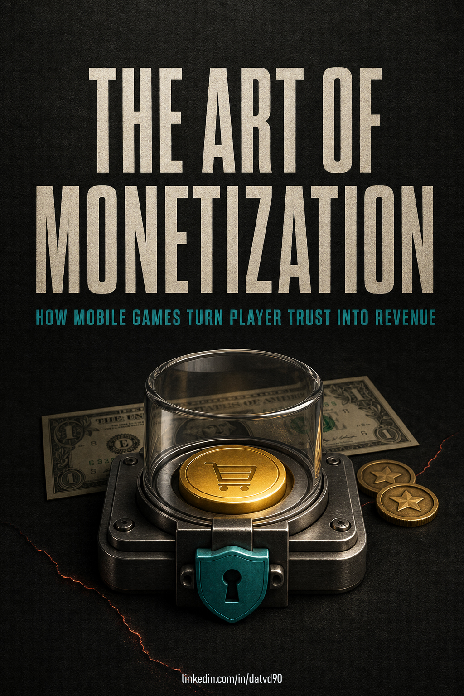

---

# THE ART OF MONETIZATION
### *The Craft of Game Economics & Sustainable Revenue*

---

## Research Note

In the game industry, few decisions survive if they lean solely on a single cute mechanic, a flashy creative, or a polished analytics dashboard. A clever mechanic isn't a product strategy; a bold creative won't bandage a broken economy; and dashboards only tell you where to look—they will never replace the visceral reality of playtesting, crisp level design, or the hardest call of all: ruthlessly killing a promising idea.

This research playbook began at a publisher workshop before ballooning into a deep forensic dive into puzzle and hybrid-casual games. The market is always throwing opportunities around, but an opportunity is worthless unless your team knows exactly which arena you’re competing in and what real problem you’re solving.

Game mechanics, themes, and monetization models get cloned far faster than the market actually understands them. Lurking behind every seemingly trivial design choice is a messy knot: player psychology, production bandwidth, and underlying economy logic. This playbook exists to dissect those hidden layers before you rush to trade your game's future for a shiny short-term market signal.

The framework pulls together core game hypotheses, mental models, real market data, and the uncomfortable questions that don't have neat textbook answers. It will continue to evolve through feedback from working developers, live publishing battle scars, behavioral data, and cohort analytics.

The most valuable feedback isn't polite applause. It’s when someone points out the exact edge case where a rule breaks, drops contradictory data, or shares a decision tool that saved their studio from an expensive trainwreck. Those are the real levers that keep this document grounded in reality.

Core mission: Build a clear, unvarnished vocabulary for product decisions—and keep refining it alongside the people in the trenches making games every day.

---

## A Note to the Reader

Making games is brutal. Monetizing them is even harder. Monetization sits at the volatile crossroads where game design, economy, user acquisition, product strategy, data science, and live ops all collide into a single continuous player experience.

Every discipline brings its own lens and blind spots. But if you want a game to scale and survive—whether you’re a Founder, Product Lead, Game Designer, Data Analyst, UA Specialist, Publisher, or Indie Dev—you need a shared reality and a common language, even if you look at the problem from different angles.

Treat every framework in this book as an aggressive stress test for your game: Which creative is worth testing? Which level needs retuning? Which ad placement actually makes sense? Which offer has an earned right to exist? Which paired metrics must be read together? And when should you pull the plug on a dead-end feature?

Keep this playbook open right next to your game build and your analytics dashboard. Its job isn't to spoon-feed you generic answers; its job is to help your team ask sharper, more uncomfortable questions every time you open the project.

---

## Key Terms

You don't need a PhD in game analytics to read this playbook. The industry terms below are used throughout the text as standard shorthand; each time they appear within a specific framework, they are defined in plain English according to their practical context.

| Term | Operational Meaning in this Playbook |
| --- | --- |
| Monetization | The strategic framework for generating revenue through advertising, in-app purchases, and live services without destroying player trust. |
| User Acquisition (UA) | The engine for driving new installs, primarily through paid ad campaigns and creative testing across ad networks. |
| In-App Purchase (IAP) | Direct microtransactions inside the game, including starter packs, virtual currencies, boosters, or permanent remove-ads options. |
| Retention | The percentage of players who return after a specific milestone (e.g., D1 is Day 1 return, D7 is Day 7, D30 is Day 30). |
| Cohort | A segment of players grouped by a shared starting point or attribute (e.g., installed on the same date, acquired from the same creative). |
| Core Loop | The primary, repeatable chain of actions a player performs during their moment-to-moment gameplay session. |
| Live Ops | The continuous operation and content renewal of a released game: recurring events, targeted offers, content drops, push notifications, and remote config tuning. |
| Creative | The promotional assets (video ads, playable ads, static banners) engineered to capture attention and trigger an install. |
| Offer | A contextual purchase or rewarded ad prompt triggered at the precise moment and emotional state where player intent is highest. |
| Funnel | The sequential journey players take: Ad Impression ➔ Store Listing ➔ Install ➔ FTUE ➔ Progression ➔ Return ➔ Monetization. |
| LTV & CPI | Lifetime Value (expected cumulative revenue per player) versus Cost Per Install (average marketing spend to acquire one user). |
| ARPDAU & IMPDAU | Average Revenue Per Daily Active User versus Average Ad Impressions Per Daily Active User. |

---

## Contents

1. Part I: The System Behind the Store
2. Part II: From Creative to First Return
3. Part III: Progress, Pressure, and Fairness
4. Part IV: Ads, IAP, and Economy
5. Part V: Signals, Decisions, and Experiments
6. Part VI: What Data Can and Cannot Decide
7. Part VII: The Operating System Behind a Live Game
8. Part VIII: Genre Playbooks
9. Part IX: The Master Audit
10. Closing: The Player Must Want to Continue
11. Research Notes and Public Sources

---

## How to Read this Playbook

Don't read this like a theoretical blog post. It only works if you use it as a surgical audit tool on an actual game.

Every chapter dissects a critical player touchpoint: from ad creatives and app store listings to the first-time user experience (FTUE), level pacing, fail states, rewarded placements, offer triggers, live events, cohort tables, store reviews, and internal team post-mortems.

• For Live Games: Keep your actual build open while reading. When you read about the first ten levels, play through those ten levels yourself. When you read about rewarded ads, find your first placement and ask: What real itch is the player trying to scratch here? When you read about IAPs, open your shop and identify the exact problem each bundle claims to solve. When you look at metrics, open your dashboard and separate genuine signals from cosmetic noise.

• For Prototypes: Use these chapters as non-negotiable quality gates before soft launch. A game that cannot clearly articulate its core promise, its first three minutes, its pressure curve, its ad value proposition, and its day-two return hook has zero business burning user acquisition budget.

Your goal isn't to blindly agree with every single framework. Your goal is to close every chapter with a sharper, more uncomfortable question for your own project—and a healthy skepticism toward easy answers.

---

## Monetization Starts Before the Store

Games rarely die inside the in-game shop. They bleed out long before the player ever sees a price tag—right at the broken links in the trust chain that make someone willing to spend in the first place:

• The creative promises a chill, satisfying puzzle, but the first 3 minutes deliver a chaotic, high-stress chore.

• The store listing fails to validate the hook that earned the initial click.

• A bloated, hand-holding tutorial robs the player of any sense of autonomy or mastery.

• An unskippable interstitial ad slams into the screen before the player has even decided if the game is worth another sixty seconds of their life.

• The level design creates artificial, unfair frustration, only to immediately shove a booster pack into the player’s face as a paid antidote to a manufactured disease.

• The team celebrates a short-term revenue bump while completely ignoring that retention, store ratings, refund requests, and player goodwill are driving off a cliff.

The in-game shop is just the checkout counter for an exchange of value. It cannot resurrect a product that fails to keep people engaged.

Before asking for a single dollar, what has your game already demanded from the player?

• First, their attention.

• Next, their click, the download, the loading wait, the first-time user experience (FTUE), and that first deliberate return session.

• Cash only flows once the game has accumulated a healthy Trust Budget.

In casual, hybrid-casual, and puzzle games, monetization is the cumulative outcome of an entire conversion journey:

Ad Impression ➔ Click ➔ Store Page ➔ Install ➔ First Launch ➔ First 10 Levels ➔ Day 1 Return ➔ Daily Habit ➔ Voluntary Rewarded Ad ➔ First IAP ➔ Repeat Purchase ➔ Live Ops ➔ Word-of-Mouth Advocacy

Every single touchpoint demands an investment from the player:

• The Creative demands curiosity.

• The Store Page demands initial credibility.

• The Loading Screen demands patience.

• The First 10 Levels build competence and trust.

• The First Ad demands consent.

• The First Offer demands a legitimate reason to spend.

• The First Event demands habitual loyalty.

Profit = Installs × (LTV - CPI)

This classic financial formula is fine for investor decks, but it's too macro and arrives far too late to guide a game designer sitting at their desk on a Tuesday afternoon.

A far more actionable operational formula for development teams is:

Monetization = Core Player Need × Right Context × Accumulated Trust × Execution Speed

• Core Player Need: The psychological driver—relief, a second chance, mastery, progression speed, collection, convenience, status, or taking back control of a chaotic board.

• Right Context: The offer appears exactly when player intent peaks—not when the studio is panicking about hitting monthly revenue targets.

• Accumulated Trust: The quiet conviction that the game plays fair, remains transparent, and respects the player's time and money.

• Execution Speed: The team's agility in reading cohort data, ad funnels, and player sentiment to continuously tune the live loop.

The operating framework of this book rests on six continuous pillars:

Promise ⟷ Progress ⟷ Pressure ⟷ Permission ⟷ Payment ⟷ Persistence

Break any single pillar, and revenue might spike today, but you're walking straight into a fatal trap:

IMPDAU (ad impressions per daily active user) might shoot up while Day 3 retention quietly collapses. A predatory starter pack might convert well today, but your app store listing will get flooded with 1-star reviews about unfair paywalls. An obnoxious interstitial might bump short-term ARPDAU while completely choking your UA team's ability to scale traffic profitably.

• Healthy Revenue gives the player an exciting reason to keep playing after every ad or purchase.

• Borrowed Revenue cannibalizes tomorrow's player base to extract cash from manufactured frustration that your gameplay cannot justify.

---

## Case Study: Clear Garden

Imagine a hypothetical hybrid-puzzle game entering soft launch called Clear Garden.

• Core Loop: Players clear overgrown botanical debris from a neglected garden by sorting matching items into a constrained tray (Match-3D / Grid sorting mechanics), gathering resources to restore garden zones (Meta-progression).

• Creative Promise: The tactile, deeply satisfying sensation of bringing order to chaos, paired with gorgeous visual garden transformations.

The initial prototype build of Clear Garden suffers from a textbook catalog of rookie monetization blunders:

1. Slams the player with an iOS App Tracking Transparency (ATT) permission prompt on the splash screen before they've even touched a single leaf.

2. Drops an unskippable interstitial ad right after Level 2, killing momentum before the player even understands the basic rules.

3. Spikes difficulty artificially at Level 7 with cluttered junk items, then immediately prompts a paid tray expansion when the player fails.

4. Sells a generic $2.99 Starter Pack loaded with abstract virtual coins without explaining what real in-game problem that currency actually solves.

5. Showers the player with generic daily login widgets, but the garden renovation lacks visual payoff or cliffhangers, leaving zero curiosity to reopen the app tomorrow.

If this were your studio's live build, which dashboard metrics would raise the alarm before you incinerate thousands of dollars on paid user acquisition?

Clear Garden is a hypothetical case study. But the mistakes above happen every single day across studios worldwide.

Throughout this playbook, we will continually return to Clear Garden to translate high-level monetization principles into concrete, screen-by-screen design solutions.

---

# Part I: The System Behind the Store

## 1. Trust Budget

In March 2023, the Federal Trade Commission (FTC) finalized a $245 million settlement requiring Epic Games to refund consumers following allegations of dark patterns, deceptive UI tricks, and unintended in-game purchases in Fortnite. By December 2024, the FTC reported distributing over $72 million in initial refunds. This wasn't an academic lecture on retention, LTV, or commercial efficiency. It was a massive public invoice proving the real cost of letting monetization flows obscure what players are actually agreeing to.

This case doesn't reveal Fortnite's exact internal economy math, nor does it pin the blame entirely on a single screen. But it exposes an undeniable truth: the payment flow does not sit outside the game experience. It is an inseparable part of the promise your game makes to the player.

Instead of asking only whether a store screen converts well, ask the harder questions: Does the player understand this choice? Did they have enough time to consider it? And will they still trust the game after the transaction completes? That is the genesis of the Trust Budget.

Every new player arrives with a finite amount of trust. An overpromising creative, a sluggish loading screen, a pushy tutorial, or a hidden close button burns down that reserve. A level that feels blatantly rigged—followed by an immediate booster offer—erodes trust even faster, because the player immediately questions whether the game engineered their failure.

Trust isn't built in dramatic, grand gestures. It is earned through unglamorous, everyday details: crystal-clear objectives, intuitive rules, controls that perform exactly as promised, rewards delivered instantly, transparent pricing, and responsive customer support when an in-game transaction hiccups.

The sum total of these details dictates whether a player sees a rewarded ad as a fair exchange or views your in-game store as a predatory trap. The framework below does not attempt to compress trust into a single synthetic number. Instead, it exposes the exact friction points that nourish or bleed trust across the player journey.

Never look at a revenue spike in isolation. Dropping an extra interstitial ad might inflate short-term ARPDAU today, but it can trigger early cohort churn, tank your store rating, and dramatically increase the cost of re-engaging lapsed users tomorrow.

Collecting money earlier is not the same thing as creating more value.

| What Builds Trust | What Bleeds Trust |
| --- | --- |
| Clear goals and transparent, predictable game rules | Creatives that promise an entirely different experience |
| Losing feels fair, with an obvious next move to improve | Artificial, unexplained difficulty spikes engineered to force spending |
| Rewarded ads are 100% voluntary and deliver immediate value | Interstitials interrupting players right in the middle of active focus |
| Clear pricing and explicit breakdowns of what is purchased | Deceptive offer timers or accidental one-click purchases |
| Instant recovery and rapid support when transactions fail | Lost rewards, broken restores, and sluggish customer service |

> **Audit Check:** When auditing your game, pick a single monetization touchpoint—such as your first interstitial or a post-fail offer. What concrete value did the player just receive? Do they understand exactly what they are exchanging? And immediately after this touchpoint, which metric will tell you whether trust was preserved or traded away for a quick buck?

## 2. Healthy or Borrowed Revenue

Think about the most recent change your team deployed to boost revenue: adding an interstitial, triggering an offer after a level loss, raising a bundle price, or cranking up difficulty on a specific puzzle. Which metric jumped immediately after the update? And which metrics did your team monitor to measure the hidden costs?

If your answer stops at gross revenue, conversion rate, or ad impressions, you're only looking at half the equation. An aggressive tweak can make this week's dashboard look phenomenal while quietly accelerating player churn, dropping review scores, and inflating content production costs over the following month.

This is the core definition of Borrowed Revenue: a change that inflates short-term metrics while sabotaging the conditions required to generate future revenue. Injecting an interstitial too early might lift ad revenue today while cutting D1 retention in half. A brutal difficulty wall might spike conversions on a post-loss bundle while filling your store reviews with complaints about pay-to-win mechanics. No monetization lever is inherently evil; the fatal mistake is failing to measure the price tag that comes attached to it.

Whenever you review a monetization update, always place the immediate upside side-by-side with its potential downstream costs. The upside might be revenue, conversion rate, ad impressions, or CPI. The cost shows up in retention, repeat payer rates, app store sentiment, refund volume, customer support tickets, and content burn rate. Pair these metrics together before declaring any change a victory.

'We increased ad load' merely describes what you did. 'We improved monetization' is a claim that requires holistic proof. Next, let's examine the foundation of that proof: bright design that ensures players understand the rules, their choices, and the real consequences of spending.

## 3. Bright Design

Open the most recent puzzle level in your game. When a player fails, what do they see first: the root cause of their loss, an alternative tactical move, or a pop-up paywall? If a booster pack appears, does the player understand exactly how it alters the board state? And if they choose not to buy, do they still have a viable, satisfying path forward? This is a self-audit, not a market survey: the answers must come directly from your own build and analytics.

Puzzle games thrive on surprise, tension, and calculated risk. If every outcome were fully predictable, the game would devolve into a mindless sequence of taps. Transparency does not mean stripping away challenge; it means giving players enough clear information to understand their options, see why they won or lost, and know exactly what they are paying for.

Bright design makes game rules, odds, pricing, and consequences effortless to parse. Dark patterns do the exact opposite: they obscure mechanics, manufacture confusion, hide exit buttons, or sell relief from artificial problems the developers deliberately engineered. The difference between ethical and exploitative monetization isn't whether your game has payments—it’s whether paying is an informed choice or the only visible escape hatch.

A near-miss is a fantastic, thrilling challenge when the player sees the exact move that could have turned the tide. It becomes toxic the moment the game hides artificial interference, repeats arbitrary failures, and positions a paid booster as the only practical way through. When reviewing a level, ask: After this loss, can the player point to a different move, a free tool, or a legitimate reason to retry?

For every purchase flow, check four vital criteria: Does the player understand the price and the exact contents? Is there a clear, intentional confirmation step? Can they easily find a cancel or refund path? And can they continue playing smoothly without paying? This isn't a rigid dogmatic formula; it is the absolute baseline for ensuring spending remains a voluntary, empowered decision.

## 4. The Operating Map

In July 2023, Sensor Tower estimated that Royal Match pulled in roughly $112 million in gross revenue and 14.6 million downloads in a single month, with 61.5% of installs coming from paid user acquisition. Sensor Tower's breakdown also highlighted their aggressive content cadence—adding roughly 200 levels every month—alongside live events like the Royal Pass and the Hidden Temple mini-game.

These figures highlight immense commercial scale and observable live-ops features, but they aren't an internal engineering schematic. They don't reveal how Royal Match balances ad placements, purchase funnels, or underlying economy sinks. A far more productive exercise is asking: How does a top-tier title connect these moving parts to turn traffic, core loops, and fresh content into long-term player lifetime value?

The Operating Map below answers that question. Its six components are not isolated silos. They are six sequential conditions: the player grasps the promise, feels tangible progression, encounters fair pressure, is invited to transact at the right moment, understands what money solves, and has a compelling reason to return tomorrow.

When one link in the chain is broken, the remaining parts might still generate revenue for a few weeks, but the studio will be forced to compensate by pouring in more ad spend, churning out more content, or cranking up artificial pressure. This operating map helps you spot those hidden cracks before vanity metrics obscure them.

Select one of your active projects and audit each row in the table. If you cannot answer a question with concrete player behavior, telemetry data, or a specific screen in your build, that is where your team must focus before building new features.

The next chapter starts at the very first link in the chain: Creative. Long before players evaluate your levels, your rewards, or your in-game store, their expectations have already been set by your ads.

| Component | Core Question to Answer | Common Failure Mode |
| --- | --- | --- |
| Promise | Why does the player want to start playing? | The creative and the actual gameplay promise two completely different experiences. |
| Progress | Why is spending another five minutes worth it? | Rewards feel meaningless and fail to show that the player has achieved anything real. |
| Pressure | Why must the player act right now? | Arbitrary frustration, opaque difficulty spikes, or excessive penalties. |
| Permission | Why is an ad or offer appropriate at this exact moment? | Monetization interrupts active gameplay flow rather than supporting the session. |
| Payment | What concrete problem does money solve? | The in-game store pushes abstract currencies when no immediate need exists. |
| Persistence | Why will the player open the game tomorrow? | Content and live events lack clear, compelling cliffhangers or meaningful goals. |

### Decision Board | Part I: The System Behind the Store

*Part II traces the complete player journey: from the very first ad impression to that crucial first return session—where players test whether your game actually keeps the promise that prompted them to hit 'Install.'*

| DO THIS NOW | ASK BEFORE DECIDING |
| --- | --- |
| • Map the complete journey from Creative to First Return; highlight every single touchpoint that demands player attention, time, or cash. • Pick your most recent monetization update and simultaneously measure: Gross Revenue, D7 Retention, App Store Rating, and Refund Rate. • Run a Bright Design test: Do players understand what they are buying, is there a frictionless exit path, and do they get the exact value promised? | • Has the game earned a sufficient Trust Budget before triggering its first commercial offer? • Is this revenue spike healthy organic growth or borrowed revenue cannibalized from the future? • If a player refuses to pay or watch an ad, do they still have a complete, fair, and satisfying gameplay experience? |
| CORE TAKEAWAYS: • Monetization starts before the store: players invest attention and patience long before they open their wallets. • A revenue increase does not equal value creation if your retention rate is quietly falling apart. • Bright design safeguards the long-term relationship between the player and your studio. | TEAM MEETING AGENDA (45 mins): • Attendees: Founder / Product Lead, Game Designer, Monetization Designer, Data Analyst, UA Lead. • Bring: Player journey map, paired revenue vs. D7/D30 retention charts, and recent app store reviews. • Target Outcome: Identify one critical trust leak to fix immediately and establish automated tracking for paired metrics. |

---

# Part II: From Creative to First Return

## 5. Creative Sells a Feeling

Nobody installs a mobile game because they're eager to examine an economy balance sheet or browse a monetization matrix. They install it because the ad promised a very specific emotional state: the deep satisfaction of sorting chaos into order, the adrenaline rush of a rescue puzzle, or the crisp triumph of conquering a fair challenge.

The commercial touchpoint of an ad creative isn't its click-through rate (CTR) or a vanity low Cost Per Install (CPI) on a spreadsheet. It is the specific feeling that attracted the player in the first place, and whether the first five minutes of gameplay actually deliver on that emotional promise. A bait-and-switch ad might generate dirt-cheap installs today, but the invoice arrives immediately: rampant early churn, 1-star reviews, and a completely decimated Day 1 retention rate.

The psychology behind this rests on Expectancy-Disconfirmation Theory (Oliver, 1980) and Self-Discrepancy Theory (Higgins, 1987). When there is a jarring gap between what marketing promised and what the software delivers, human psychology reacts with immediate disappointment and defensive withdrawal. This doesn't mean creative experimentation is useless. But it establishes an unbending rule: the wider the chasm between your ad promise and your first ten levels, the faster you incinerate your player's initial trust budget.

Take your top three user-acquisition creatives and put them side-by-side with the first three minutes of your actual gameplay. Does the player immediately recognize the mechanic they just watched in the ad? Do they experience the exact same emotional payoff? If the answer is no, your team isn't just wasting marketing budget—you're actively sabotaging your conversion funnel before players even know your store exists.

## 6. Store Listing and First Open

Your app store listing is where players double-check your marketing claims, and that very first app launch is where they pass their final verdict.

Track a cohort from your best-performing ad creative through three critical milestones: the ad-to-store conversion rate, the install rate, and their first sequence of taps after opening the app. If an ad promotes a clean, relaxing sorting puzzle, but the store page showcases an elaborate mansion-building meta-game, you've forced the player to reconcile two conflicting narratives before they've even touched level one. If the first launch immediately ambushes them with login dialogs, privacy disclaimers, push notification prompts, and leaderboard pop-ups, the question isn't 'which prompt converts better.' The real question is: Did the player experience the value they came for before you started making aggressive demands on their attention?

The cognitive science foundation here is John Sweller's Cognitive Load Theory (1988). Sweller differentiates between the intrinsic cognitive load required to master a task and the extraneous load caused by clumsy, cluttered presentation. Research on worked examples (Sweller, Chen, Retnowati & Kalyuga, 2020) proves that novices learn significantly faster when their attention is strictly focused on core structural patterns. In the first few minutes, every pop-up that doesn't directly validate your core promise is actively competing with the player's cognitive bandwidth and dwindling patience.

Design the first-open experience as a rapid sequence of undeniable proof. If your ad promised a high-stakes rescue scenario, the player's very first interaction should be solving that exact rescue scenario—not navigating a bloated main menu. If your ad promised tactile sorting bliss, let them immediately clear a messy board, enjoy the crisp visual feedback, and only then introduce the next objective. Once that initial micro-victory is secured, you've earned the right to offer a meaningful choice—like an opt-in rewarded ad for extra moves or a well-timed starter pack. A/B test these interaction timings against tutorial completion, D1 retention, permission opt-in rates, and user sentiment.

Compliance requirements like Apple's App Tracking Transparency (ATT) or privacy consents are non-negotiable. The difference lies in timing and context: Does the player understand why you're asking for permission in relation to the fun they just experienced? Treat your store listing as the promise, the first launch as the proof, and permission prompts as requests you only trigger once you've delivered tangible value. Once that initial trust is cemented, the first ten levels must answer the next existential question: Does your game teach players how to win, how to accept failure, and how to use monetization options fairly?

## 7. The First Ten Levels

Open the first ten levels of your current build and lay them alongside their raw telemetry event logs. With each passing level, did the player actually learn a new rule, gain greater tactical agency, or did they simply slam into artificial roadblocks? Did they receive their first booster before or after they understood how it alters the board state? Was your first in-game offer triggered by an organic, relatable bottleneck that they just experienced?

These questions form the economic bedrock of your early game: a commercial offer only holds perceived value if the player clearly understands the specific headache it solves. Otherwise, any initial conversion is merely an emotional reaction to artificial frustration, and the real cost will show up as early abandonment, plummeting retry rates, and angry store reviews.

Cognitive Load Theory offers a vital operational rule: new players require clear visual scaffolding to build an internal mental model of the game, after which that scaffolding must fade so they can apply their skills independently. In puzzle games, guidance doesn't mean walls of tutorial text. It means a compact board, an unmistakable visual objective, a subtle ghosted hint, and immediate feedback on their choices. Ask yourself: Is this level illuminating a mechanic, or is it overloading the player with too many variables before they've even grasped the basics?

A best-in-class onboarding ramp moves from an intuitive guided demonstration, to a similar puzzle with less hand-holding, to that first genuine fail state where the player completely understands why they lost. During level design reviews, evaluate four core criteria for every stage: What is the player learning? Which decision triggers a win or a loss? What free tactical alternative remains after a defeat? And does a booster expand strategic freedom or merely patch up sloppy level tuning? Track fail rates alongside retry rates, level progression velocity, booster usage, and hard churn. A high fail rate paired with high retries indicates an addictive, well-balanced challenge; a high fail rate paired with instant app quits is a code-red warning sign that your level design is broken.

## 8. The First Return

Before your team spends hours drafting clever push notification copy, pull up the cohort of players who closed your app after their very first session and ask: At the exact moment they exited, what unfinished goal were they excited to complete next?

If your team cannot point to a concrete, cliffhanger objective inside the game, then your push notification is nothing more than spam begging them to return to a void. This is the financial reality of the first return: Day 1 retention unlocks every downstream opportunity—rewarded ads, progression offers, live events, and long-term monetization. It cannot be compensated for by sending a notification at 7:00 PM on schedule.

The behavioral mechanism here is the Goal-Gradient Hypothesis (Hull, 1932; empirically validated by Kivetz, Urminsky & Zheng, 2006): human effort, motivation, and velocity accelerate dramatically as people perceive themselves closing in on a finish line. Seeing the goalpost within reach triggers an instinctual urge to re-engage. This raises an essential product question: Is the in-game goal concrete enough? Is the remaining progress visually obvious? And is the pending reward enticing enough to compel the player to reopen the game tomorrow to claim it?

An effective return hook doesn't have to rely on artificial energy meters, daily login checklists, or countdown timers. It could be an enticing new garden area just waiting to be unlocked, a card album missing one final piece, a construction project one step from completion, or a tricky puzzle where the player figured out the solution right as their previous session ended. The golden rule is that players must know exactly why they are coming back. Run an A/B split: Group A exits after claiming a generic reward popup; Group B exits while looking at a tantalizing, nearly completed milestone. Compare D1 retention, session frequency, and first-offer conversions to let real player behavior guide your design.

Energy systems only provide real value when they serve as rhythm modulators—such as limiting attempts in a competitive event, enforcing strategic stakes, or protecting long-term content pacing. Once the first return is secured, the challenge evolves: With every return session, does the player experience meaningful progress? Part III dives deep into the architecture of meaningful progression, balanced pressure, and unwavering fairness.

### Decision Board | Part II: From Creative to First Return

*Part III examines the quality of player progression, psychological pressure, and design fairness—the bedrock conditions that transform initial return sessions into sustainable, long-term commercial value.*

| DO THIS NOW | ASK BEFORE DECIDING |
| --- | --- |
| • Map the Promise Chain: Creative ➔ Store Listing ➔ First 3 Minutes; flag every emotional discrepancy. • Audit your First 10 Levels: Record player mastery, win/loss clarity, and free non-monetized options after failure. • A/B Test Session Endings: Compare exiting after a generic reward versus exiting on a visible, unfinished milestone. | • Did the player experience the core promise before being prompted for permissions or ads? • Does the early game teach mastery and autonomy, or does it merely force players through artificial hurdles? • When a player exits, do they know the exact objective they will return to complete tomorrow? |
| CORE TAKEAWAYS: • The ad creative buys the install but simultaneously sets the ceiling for FTUE, D1 retention, and LTV. • Premature permission dialogs compete directly with a new player's limited cognitive bandwidth. • A tangible, unfinished in-game goal drives retention far more effectively than any push notification. | TEAM MEETING AGENDA (45 mins): • Attendees: Game Design, UA Creative Lead, Data Analyst, Product Lead. • Bring: Top 3 UA video creatives, screen recordings of Levels 1–10, FTUE funnel data, and D1 by creative cohort. • Target Outcome: Identify one creative-gameplay mismatch to fix immediately, test permission re-timing, and assign owners. |

---

# Part III: Progress, Pressure, and Fairness

## 9. Player Motivations

Players don't open your game for the same reasons. Some crave pure skill mastery, some want the calming relief of organizing a cluttered space, others are obsessive collectors, and some just want to blast through content as fast as possible. Self-Determination Theory (Ryan & Deci, 2000) identifies three universal psychological needs: Competence (feeling effective and skilled), Autonomy (having genuine control over choices), and Relatedness (feeling connected). A game achieves sustainable monetization when its commercial touchpoints support and respect these psychological drives instead of hijacking or suffocating them.

| Player Archetype | What They Seek | What They Hate | Natural Monetization Fit |
| --- | --- | --- | --- |
| Relaxation Seeker | Calm pacing, clarity, and stress relief | Loud, jarring interruptions and aggressive countdowns | Permanent ad removal, optional cosmetic hints, ambient upgrades |
| Problem Solver | Transparent logic and intellectually fair puzzles | Hidden RNG that masks why a move failed | Tactical undos, precision single-target tools, extra planning time |
| Completionist | Total closure, completion bars, and ownership | Rewards that disappear into meaningless number sinks | Themed sticker albums, garden decorations, exclusive badges |
| System Optimizer | Peak efficiency, strategic forecasting, and speed | Opaque currencies with unpredictable conversion rates | Battle passes, tiered milestone trackers, resource multiplier packs |
| Time-for-Value Trader | Explicit, predictable returns for invested time | Forced unskippable ads with no tangible reward | Rewarded video replay tokens, grindable soft currency sinks |
| Convenience Buyer | Frictionless sessions and zero artificial waiting | Repetitive, trivial bottlenecks designed purely to stall | Permanent remove-ads bundles, starter packs, instant energy refills |

The monetization touchpoint of player motivation lies in behavioral segmentation: on a brutally difficult level, a skill-driven problem solver will gladly retry ten times to prove their mastery, while a relaxation seeker will happily tap a rewarded ad or buy three extra moves to release the tension. If your game treats both players with the same blunt instrument—slapping an aggressive paywall on the screen—you immediately destroy the mastery seeker's autonomy and drive them straight out of your game.

Segment your telemetry data by behavioral motivation: track opt-in rates on rewarded placements, booster purchase velocity, retry frequency per fail state, and average session depth. Stop blasting a single generic bundle at your entire player base. Design contextual commercial touchpoints that align with distinct psychological states.

When players feel that their autonomy and competence are genuinely respected, spending real money or watching a 30-second ad feels like an empowered choice to enhance their experience—not a ransom paid to escape developer-inflicted misery.

## 10. Meaningful Progress

Bumping an integer from Level 10 to Level 11 is not 'progress.' Moving to the next stage only feels rewarding if Level 11 introduces an intriguing new mechanic, reveals a stunning visual space, or visibly contributes to a larger meta-objective the player actually cares about. When progression is reduced to an endless, soulless treadmill of identical levels, perceived value flatlines.

The economic connection between progression and monetization is simple: players only spend money or watch ads to protect or accelerate progress they genuinely care about. If beating a grueling puzzle yields zero visual celebration, narrative payoff, or meta-advancement, the player has zero motivation to use a booster or buy extra moves the next time they hit a wall.

Audit your entire progression tree: ensure that after every major milestone, the player receives a tangible visual reward, unlocks an exciting feature, or watches their game world visibly transform. Meaningful progress is the anchor that secures long-term retention and gives every transaction in your game an authentic reason to exist.

## 11. Pressure Creates a Decision

Pressure in game design—whether it's a ticking timer, a move counter, or a shrinking tray—is the engine that manufactures dramatic tension. But pressure is only healthy when the player knows that sharper thinking or a better tactic would have carried them across the finish line without opening their wallet. When pressure is ratcheted up so high that skill becomes irrelevant, tension mutates into resentment and coercion.

The monetization moment of pressure lives right at the decision point: when a player lands in a genuine near-miss state—one single move away from clearing an intricate board—offering extra moves via a rewarded ad or a micropayment feels organic and fair. But if the board was hopelessly bricked from turn one due to malicious RNG, that same offer feels like extortion.

Audit every friction point in your game: ensure that players can always dissect their failures, pinpoint their misplays, and see at least one viable, skill-based path to victory before presenting a paid lifeline.

## 12. Dynamic Difficulty

Dynamic Difficulty Adjustment (DDA) exists to keep players anchored in the Flow State (Csikszentmihalyi, 1990)—that sweet spot where challenge perfectly balances skill. Yet the line between adaptive assistance and rigged outcomes is razor-thin. When DDA secretly manipulates board outcomes to force a loss and trigger a sale—or hands out patronizing unearned wins—it detonates the player's sense of achievement and destroys their belief in the game's integrity.

The second a player realizes that winning or losing has nothing to do with their decisions and everything to do with an algorithm calculating the optimal moment to extract a dollar, they stop caring emotionally. The revenue extracted from manipulative difficulty rigging is the purest form of Borrowed Revenue.

| Observable Telemetry Signal | Diagnostic Interpretation | Immediate Design Action |
| --- | --- | --- |
| High fail rate + High retry rate | Challenge is compelling, engaging, and perceived as fair | Verify that players are learning and improving over attempts |
| High fail rate + Low retry rate | Level feels unfair, opaque, or artificially bricked | Review session telemetry; ensure game rules and mechanics are crystal clear |
| Low fail rate + Shallow session length | Too easy, lacking stakes, risk, or meaningful decisions | Introduce dynamic tactical choices and meaningful friction |
| High booster usage + Low progression to next level | Paid tools are acting as a crutch for broken level design | Fix the underlying level mechanics before selling stronger boosters |

Establish strict transparency rules for your balancing systems: DDA should only serve as an invisible safety net to catch players stuck in an abnormal losing streak. It must never be weaponized as a predatory trap to force in-app purchases.

A resilient game economy is built on deep respect for player effort, where victories feel earned and every defeat is a lesson players can understand.

## 13. Randomness and Skill

Random Number Generation (RNG) is the spice that injects surprise, replayability, and variety into puzzle games. But randomness is only welcomed when it acts as Input Randomness—generating initial board conditions for the player to strategize against—not Output Randomness, which arbitrarily overrides the player's deliberate execution.

Inspect failed board replays across diverse random seeds. Can the player look back and spot an alternative line of play that could have won, or do replays reveal that victory was mathematically impossible without a lucky piece drop? When randomness turns a puzzle into pure roulette, booster packs are seen as pay-to-win cheats rather than tactical tools.

Evaluate RNG by reviewing real gameplay replays rather than admiring theoretical drop-rate spreadsheets. Monitor post-loss retry rates, booster consumption velocity, quit rates, and cohort return curves to ensure randomness fuels curiosity rather than despair.

## 14. Reward Feedback

Every reward handed to a player must be validated with visual flair, crisp audio, and haptic feedback that match the effort required to earn it. A monumental reward earned after conquering a brutal 5-level streak that displays as a flat, uninspired text banner cheapens the accomplishment. Conversely, blowing fireworks and confetti over a routine, trivial action creates emotional numbness.

Reward feedback directly shapes perceived value: when players receive genuine celebration for their achievements, they invest deeper emotional equity into your game world and fiercely value their accumulated resources. This emotional resonance builds the psychological foundation for pricing in-game items and shop bundles.

The golden rule of reward pacing: routine micro-rewards get snappy, crisp feedback; rare, hard-won milestones get an unforgettable celebration that marks a true breakthrough in the player's journey.

### Decision Board | Part III: Progress, Pressure, and Fairness

*Part IV translates these psychological and design principles into concrete commercial mechanisms: Rewarded Ads, Interstitials, Boosters, In-App Purchases (IAP), and Live Event Economies.*

| DO THIS NOW | ASK BEFORE DECIDING |
| --- | --- |
| • Map player motivation by cohort: analyze psychological needs, free progression options, offer triggers, and long-term engagement. • Audit high-churn levels: ensure there is always at least one tactical winning path that requires zero paid boosters. • Standardize reward feedback: keep routine rewards snappy; make major milestone celebrations spectacular. | • Is this difficulty spike generating dramatic excitement or manufactured frustration to force a sale? • Does the player understand why they lost and feel that winning is 100% within their grasp? • Is randomness providing interesting tactical inputs or nullifying the player's deliberate strategy? |
| CORE TAKEAWAYS: • Progression is only meaningful when it visibly alters something the player genuinely values. • Manipulating difficulty to force monetization is borrowing revenue from your game's future. • Fairness and respect for player autonomy are the lifeblood of a sustainable game economy. | TEAM MEETING AGENDA (45 mins): • Attendees: Lead Game Designer, Level Designer, Economy Designer, Data Analyst. • Bring: Difficulty curves by level, retry rates, booster consumption heatmaps, and player community feedback. • Target Outcome: Rebalance the top 3 offending levels, set strict DDA guardrails, and agree on fairness benchmarks. |

---

# Part IV: Ads, IAP, and Economy

## 15. Rewarded Ads

A rewarded ad is an explicit, voluntary contract between the player and the game: the player trades 30 seconds of their attention in exchange for an immediate, tangible in-game benefit. At its core, a rewarded ad is not a forced commercial disruption—it is a well-timed, player-driven utility.

Architect every rewarded ad placement around an unmistakable value exchange: 'After facing situation X, the player can voluntarily watch an ad to receive benefit Y, which directly solves their immediate hurdle.' If the reward is insulting or completely disconnected from the player's immediate goal, they will ignore it; if the reward is so ridiculously overpowered that it collapses your entire game economy, players will lose all motivation to solve puzzles skillfully or ever consider an in-app purchase.

| Player Need | Value Exchange | Guardrail Condition |
| --- | --- | --- |
| Extend Session | Extra moves or an instant revive after a near-miss | Never used to patch artificial, hidden difficulty walls. |
| Preserve Rewards | Double earned soft currency or event tokens | Base rewards must remain meaningful without the multiplier. |
| Test Power-ups | Free trial of a premium booster on a tricky board | Clearly explain what happens after the single-use trial ends. |
| Reduce Wait Times | Instant partial energy refill or speed-up | Core game loop must never be fully paywalled. |

There is no universal 'ideal' rewarded ad opt-in benchmark that fits every genre. Audit your placements against your own empirical telemetry: opt-in engagement rate, average daily impressions per active user, video completion rate, and most importantly, retention curves following reward claims. Ensure that rewards are granted accurately, instantly, and reliably.

When rewarded ads are built as a fair, dignified lifeline, they don't just protect retention—they actively deepen player goodwill toward your game.

## 16. Interstitials

Interstitial ads are the most aggressive, high-risk format in mobile gaming. When dropped without warning while a player is deep in strategic thought, or immediately after an infuriating loss, an interstitial triggers instant visceral rage and sparks immediate uninstalls. The monetization equation of an interstitial demands extreme caution: the micro-cents generated from an ill-timed impression will never compensate for the lost Lifetime Value (LTV) of a churned player.

Research on cognitive distraction (Stothart, Mitchum & Yehnert, 2015) proves that even brief, jarring interruptions completely derail human working memory and flow. Consequently, the only defensible placement for an interstitial is at natural psychological breakpoints—such as immediately after completing a stage, claiming final victory rewards, and transitioning to a new world map.

Enforce strict operational guardrails: implement aggressive frequency capping, never trigger interstitials during the first few onboarding levels, automatically purge all forced interstitials for any user who purchases an IAP, and always provide a prominent, responsive close button. Always monitor IMPDAU side-by-side with D1/D7 retention to catch early signs of player fatigue.

## 17. Boosters

A booster is a precision tactical tool that empowers the player to influence the board state—clearing a stubborn obstacle, shuffling impossible tiles, or adding crucial extra moves. A well-designed booster makes the player feel clever and in command of their strategy. Conversely, if a level is engineered so unfairly that victory is mathematically impossible without burning a booster, that booster ceases to be a strategic tool—it becomes an extortion fee that strips away all satisfaction of winning.

Examine booster consumption data level-by-level: if a specific stage exhibits a massive spike in booster usage paired with a surge in player churn, that level is broken—players aren't thrilled to spend; they're quitting in frustration. Forcing booster burn through unfair difficulty quickly depletes a player's resource reserves and pushes them into an insurmountable dead end.

Position boosters as creative expansions of tactical freedom. Ensure a steady, baseline trickle of free boosters through progression milestones and live events so players can experience their power before deciding to buy more in the store.

## 18. IAP and Present Need

An in-game shop is a static catalog. A contextual offer is an urgent solution presented at the exact moment a player encounters a pressing problem. Players don't open their wallets because a shop interface is pretty; they spend because they are facing an immediate obstacle and your offer provides an honest, compelling, and reasonably priced resolution.

Generic bundles filled with abstract virtual currencies only appeal to deeply engaged veterans who already have a master's degree in your game's economy. For everyone else, offers tied directly to real-time context—such as a last-second rescue offer on a near-miss, a high-value Starter Pack bundled with permanent ad removal, or an event-themed progression bundle—generate significantly higher conversion rates and far greater customer satisfaction.

| Product SKU | Legitimate Operational Purpose | Predatory Failure Mode |
| --- | --- | --- |
| Remove-Ads Bundle | Protects gameplay flow for dedicated players | Vague terms that still force banner or event ads. |
| Starter Pack | Delivers an exciting early-game power surge | Pushed aggressively before the core loop proves its fun. |
| Piggy Bank Vault | Converts accumulated progress into an optional purchase | Deliberately starves the base economy to force bank unlocks. |
| Continue Offer | Saves a high-stakes, hard-fought run on a near-miss | Appears after an incomprehensible, unfair defeat. |
| Battle / Season Pass | Celebrates and rewards long-term engagement | Content cadence is too slow to support the pass track. |

Ensure every IAP offer explicitly communicates three things: exactly what the player gets, the concrete problem those items solve, and a frictionless, guilt-free decline button that never makes the player feel like a second-class citizen.

Commercial transparency and respect during checkout are the golden keys that turn free-to-play users into loyal, repeat payers throughout the life of your game.

## 19. Economy Integrity

The in-game economy is the circulatory system that pumps resources and currencies through your game. A resilient economy obeys the physical laws of Stock-and-Flow balance: every currency must have tightly regulated sources (faucets), compelling sinks (drains), and maintain a healthy median wallet balance so players always have a hunger to engage with live events and features.

Currency inflation is the silent killer of mobile games: when a game showers players with soft currency without providing irresistible sinks, the currency becomes worthless. Future event rewards lose all psychological value, and in-game shop bundles become irrelevant. On the flip side, an economy choked by extreme scarcity leaves players feeling exhausted and triggers mass abandonment.

Regularly audit core economic health across player cohorts: track median wallet balances, accumulation velocity, sink distribution, and spending allocation across product categories. Protecting your economy's integrity is protecting the very soul of your game.

## 20. Event Economy

Live events and battle passes exist to rejuvenate the core rhythm, establish high-energy short-term goals, and cultivate community momentum.

A masterclass live event is a self-contained, virtuous loop:

Engage in Core Gameplay ➔ Accumulate Event Tokens ➔ Unlock Tiered Choices ➔ Climb Leaderboards ➔ Cross Finish Line ➔ Claim Milestone Rewards.

According to Sensor Tower estimates, Royal Match consistently generates over $100 million in gross monthly revenue by seamlessly rotating high-cadence live events like the Royal Pass and Hidden Temple alongside an relentless content rollout. This data proves the power of live ops; however, the lesson isn't to blindly copy their calendar. The real insight is understanding how they tier objectives: free-to-play users always have an achievable milestone path, while the premium pass offers massive acceleration for invested spenders.

During post-event post-mortems, isolate event-driven revenue from downstream health: check post-event D1/D7 retention, post-event currency balances, return rates the following week, and community sentiment. Ensure the event left players energized—not completely burned out and financially drained.

### Decision Board | Part IV: Ads, IAP, and Economy

*Part V shifts focus from product design mechanics to data-driven decision frameworks: dashboard diagnostics, paired metric analysis, and rigorous experimentation protocols to avoid being deceived by vanity metrics.*

| DO THIS NOW | ASK BEFORE DECIDING |
| --- | --- |
| • Map all rewarded and interstitial ad placements: specify triggers, reward values, natural breakpoints, and frequency caps. • Implement an automatic rule that permanently disables all forced interstitials for any user who purchases an IAP. • Build a Stock-and-Flow balance sheet: monitor median currency balances and sink consumption velocity by cohort. | • Is this ad placement supporting player flow or violently interrupting their focus? • Does this IAP bundle solve an authentic player problem, or is it an artificial attempt to hit studio revenue KPIs? • After this live event concludes, will the base economy suffer from inflation, and will players still want to return? |
| CORE TAKEAWAYS: • High ad impressions or conversion rates do not prove long-term value creation or player retention. • Boosters are tactical expansion tools, not structural bandages for poor level design. • A successful event leaves players feeling satisfied and eager for the next chapter. | TEAM MEETING AGENDA (60 mins): • Attendees: Product Lead, Monetization Lead, Economy Designer, LiveOps Manager. • Bring: Ad placement performance reports, IAP conversion funnels, currency inflation tracking, and the live event calendar. • Target Outcome: Rebalance underperforming offers, optimize rewarded ad placements, and finalize event economy parameters. |

---

# Part V: Signals, Decisions, and Experiments

## 21. Reading the Dashboard

Never open an analytics dashboard just to admire pretty line charts. Approach your data with a blunt, hypothesis-driven product question: 'Is the creative promise holding true through the first ten levels?', 'Are players churning abnormally at our new interstitial placement?', or 'Is this new starter pack generating healthy revenue or quietly destroying the D7 retention of new cohorts?'

| Diagnostic Question | Paired Metrics to Read Together | Immediate Verification Action |
| --- | --- | --- |
| Is the core promise holding true? | CTR, Store Conversion Rate, FTUE Completion Rate, D1 by Creative Cohort | Compare the UA video ad, store listing, and the first 3 minutes of gameplay across cohorts. |
| Is the first fail state fair? | Fail Rate, Retry Rate, Session Drop-off Rate, Booster Usage Frequency, Store Reviews | Watch actual gameplay recordings; distinguish between a thrilling challenge and unfair frustration. |
| Does this ad placement add real value? | Opt-in Rate, IMPDAU, Video Completion Rate, Post-Ad Quit Rate, D1 Retention | A/B test placement triggers or timing while keeping the reward constant to measure player appetite. |
| Does this IAP solve an authentic need? | Offer Impressions, Conversion Rate, Non-Buyer Retention, Refund Rate, Repeat Payer Rate | Audit offer transparency, perceived value, and the gameplay experience when players decline to buy. |

A dashboard tracking 500 uncurated metrics without an action plan is just vanity noise. Data only provides real leverage when it reflects the psychological health of the relationship between player and game, pointing directly to where the team needs to intervene.

| Diagnostic Domain | Critical Strategic Metric | Core Strategic Decision Question |
| --- | --- | --- |
| User Acquisition | CTR, IPM, CPI, Store Page Conversion Rate | Is the marketing creative attracting the right audience for the actual game? |
| Activation & FTUE | Load Time, Crash Rate, Tutorial Completion, Levels 1–10 Velocity | Does the game prove its core promise fast enough to earn trust? |
| Engagement | Session Count, Session Length, Retry Rate, D1/D3/D7 Retention | Does the core loop create a compelling reason for players to return? |
| Difficulty Balance | Level Fail Rate, Churn on Loss, Booster Burn Velocity | Is game pressure acting as a motivator or an infuriating paywall? |
| Advertising Health | Rewarded Opt-in Rate, IMPDAU, Post-Ad Drop-off Rate | Are ad placements structured as helpful, fair value exchanges? |
| IAP & Monetization | Offer Views, Conversion Rate, Repeat Payer Rate, Refund Volume | Is the game maintaining long-term economy integrity and buyer trust? |
| Community Trust | Star Rating, App Store Review Sentiment, Support Ticket Volume | Is the studio's long-term relationship with its audience strengthening or eroding? |

The methodological foundation here is Causal Inference: an observational data point on a dashboard never explains its own root cause. To understand what is actually happening, the team must construct a logical causal hypothesis and test it against cohort-segmented behavior.

Make hypothesis-driven data reviews an unbreakable studio habit: turn every metric review into a rigorous debate about the player experience, culminating in concrete, testable adjustments.

## 22. Read Metric Pairs

Never read a growth metric in isolation. Every single change you make to a game creates a double-edged sword: an upward spike in one metric usually carries the risk of damaging another. If you only look at one side of the ledger, you're living in a dangerous fantasy world.

| Short-Term Growth Metric | Mandatory Paired Counter-Metric | Underlying Diagnostic Question |
| --- | --- | --- |
| CTR (Ad Click-Through Rate) | Store Conversion Rate, D1 Retention, Session Depth | Is the creative attracting genuinely interested players or clickbaiting unqualified traffic? |
| Short-Term IAP Revenue | D7/D30 Retention, App Store Ratings, Refund Rate | Did this bundle deliver authentic value or exploit temporary player frustration? |
| IMPDAU (Ad Impressions / User) | Average Session Duration, Churn Rate | Is this ad frequency supporting gameplay or violently destroying flow? |
| Level Pass Rate | Booster Usage Rate, Post-Loss Retry Rate | Are players conquering the level through mastery or being forced to buy a way out? |
| Live Event Revenue | Post-Event D7 Retention, Post-Event Wallet Balances | Did the event create new engagement or merely borrow future spend from next week? |

Always evaluate your game through Paired Metrics:

• Average Revenue Per Daily Active User (ARPDAU) must be read alongside Day 7 Retention (D7).

• IAP Conversion Rate must be read alongside App Store Ratings and Refund Rates.

• Average Ad Impressions (IMPDAU) must be read alongside Session Length and Churn Rates.

• Cost Per Install (CPI) must be read alongside FTUE Completion and Realized LTV.

## 23. Decision Trees

When Day 1 retention stumbles, the default knee-jerk reaction in many studios is to immediately slash level difficulty or shower players with free currency. Yet the real culprit might be that your top UA ad is promising an entirely different genre, or that an aggressive iOS tracking permission prompt is firing on the splash screen and killing momentum.

If D1 is solid but D3 and D7 take a nosedive, look elsewhere: check for a lack of day-two return hooks, an artificial difficulty wall, excessive interstitial ad frequency, or a repetitive lack of content in the second session. A Decision Tree forces your team to systematically trace root causes through logical diagnostic branches instead of spraying emotional guesses at the problem.

Standardize your studio's diagnostic workflow:

Observe the Symptom ➔ Formulate Causal Hypotheses ➔ Verify with Paired Cohort Telemetry ➔ Deploy a Controlled Intervention.

The output of a decision tree must always be a falsifiable hypothesis, a single designated owner, and a clear measurement timeframe. When data is inconclusive, having the discipline to say 'we don't know yet' and digging deeper is infinitely better than blindly burning capital on user acquisition.

## 24. Experimentation

A/B testing is the ultimate scientific engine for product optimization. But experimentation quickly degenerates into an expensive circus if a team modifies five variables at once or launches tests without an explicit causal hypothesis.

| Before You Ship | Proceed Only When |
| --- | --- |
| Clear Hypothesis | You have articulated the exact behavioral mechanism and the minimal viable change required to test it. |
| Metric Alignment | You have locked in a primary metric, guardrail counter-metrics, and a cohort-based evaluation framework. |
| Decision Protocol | You have pre-committed in writing to your keep, iterate, rollback, or kill thresholds before seeing the data. |
| Team Memory | You have assigned a single DRI (Directly Responsible Individual) and logged the test context in a shared repo so mistakes aren't repeated. |

A professional experiment must meet four strict criteria: a clear causal hypothesis, sufficient sample size to reach statistical significance, rigid guardrail metrics to safeguard overall player experience, and an instantaneous rollback protocol if the variant harms retention.

Maintain a structured repository of test debriefs: the lessons extracted from a failed experiment frequently provide far more strategic value than an unexplainable short-term revenue bump.

Remote configuration tools give you incredible operational flexibility to deploy and toggle features on the fly, but they will never compensate for sloppy experimental design.

### Decision Board | Part V: Signals, Decisions, and Experiments

*Part VI explores an essential strategic frontier: where market intelligence and algorithmic tools can accelerate your team, and the absolute boundaries where data will never replace human product judgment.*

| DO THIS NOW | ASK BEFORE DECIDING |
| --- | --- |
| • Configure dashboards strictly by Paired Metrics (ARPDAU alongside D7 Retention; IMPDAU alongside Churn Rate). • Build diagnostic decision trees to isolate the root cause whenever D1 or D7 retention experiences volatility. • Standardize your A/B testing workflow: define explicit causal hypotheses, guardrail metrics, and rollback plans. | • Is this short-term metric gain quietly destroying player trust and long-term retention? • What behavioral mechanism explains this trend, and what specific evidence would disprove our hypothesis? • Does this experiment eliminate a critical strategic uncertainty, or is it merely random feature tweaking? |
| CORE TAKEAWAYS: • A metric is only meaningful when balanced against the hidden cost incurred to achieve it. • Telemetry tracks superficial actions; empathy and causal logic uncover the root truth. • Admitting 'we don't know yet' is always better than scaling spend on shaky assumptions. | TEAM MEETING AGENDA (45 mins): • Attendees: Head of Product, Data Lead, UA Lead, LiveOps Lead. • Bring: Paired metrics dashboard, cohort retention curves, and active A/B test results. • Target Outcome: Make definitive ship/rollback decisions on active tests based strictly on guardrail metrics. |

---

# Part VI: What Data Can and Cannot Decide

## 25. Market Intelligence

Market intelligence platforms like Sensor Tower and AppMagic give you a macro bird's-eye view of top-grossing genres, revenue scale, and user acquisition dynamics. This data is extraordinarily valuable for screening out bad bets and spotting fertile sub-genres before you write a single line of code.

| Market Signal | Product Thesis |
| --- | --- |
| Filters broad market genres, mechanics, art themes, and macro competitive dynamics. | Defines the core emotional loop your studio can execute distinctly better than competitors. |
| Derived from third-party intelligence platforms (Sensor Tower, AppMagic). | Forged and validated internally through rapid playable prototypes and internal cohort telemetry. |
| Narrows the opportunity space to eliminate weak bets before allocating production capital. | Creates a unique value proposition and a compelling reason for players to stick around for years. |

However, market intelligence only tells you what worked for someone else in the past. It cannot guarantee that your studio possesses the design craft, content velocity, or player empathy required to build a market-leading title in that exact space.

Analytics can report that screw puzzles, rescue themes, or season pass tracks are printing money across the charts. But data will never tell you if your team can make the moment-to-moment loop more tactile and satisfying than the incumbent, preserve player trust, or manage a live economy without breaking it. That is the divide between market intelligence and a Product Thesis.

A Market Signal is external observation: 'Players are spending significant time and cash in this sub-genre.' That is merely your starting clue.

A Product Thesis is an internal commitment: 'Our team has the specific craft to deliver a visibly superior gameplay experience, retain players longer, and operate an economy with positive contribution margins.'

A market signal tells you where to dig; your product thesis determines the quality of the ore you pull out of the ground.

## 26. Behaviour Needs Interpretation

A telemetry dashboard only logs what happened after a design update; it never explains what players were thinking or feeling when they took that action. A sudden spike in revenue could be driven by genuine delight, a confusing UI misclick, or a toxic difficulty wall causing panic buys. The question 'What does the data say?' is only step one. The critical question must always be: 'What psychological mechanism drove this behavior, and what evidence would disprove our theory?'

For instance, if tray expansion purchases in Clear Garden spike dramatically at Level 7, that single data point could be caused by four completely different realities: an exhilarating, fair challenge; an irresistible promotional discount; an unfair board state causing desperate panic; or accidental misclicks due to clumsy button placement. Each explanation leads to a completely different future for your game.

Watch actual screen recordings of player sessions, read app store reviews line by line, interview real players, and analyze behavioral cohorts deeply before jumping to conclusions.

Never let cold, abstract numbers blind you to the living, breathing human experience happening on the other side of the glass.

## 27. Decision Memo

A standard game design document often reads like an endless wish list of features: 'Build a rescue-themed puzzle game, add a daily quest system, insert a starter pack.' This feature-factory approach is how studios blow through budgets without ever finding product-market fit.

Instead, standardize every product proposal into a crisp, one-page Decision Memo built around five mandatory components:

Player Problem to Solve ➔ Causal Intervention Hypothesis ➔ Supporting Market & Internal Data ➔ Guardrail Metrics & Strategic Risks ➔ Success Criteria or Immediate Kill Conditions.

When an entire studio operates through transparent decision memos, accountability becomes unmistakable and the organization's collective learning velocity skyrockets.

A brilliant decision is measured by the rigor of its logic and the speed at which its hypotheses can be verified—not by the graphic polish of a 50-slide presentation.

| Strategic Domain | Concrete Application for Project: Clear Garden |
| --- | --- |
| External Market Signal | Order-and-clear sorting mechanics are demonstrating immense commercial momentum across top-grossing charts. |
| Core Player Motivation | The psychological satisfaction of restoring order from clutter and watching a neglected garden visibly blossom. |
| Product Expression | A constrained tray capacity, tactile 3D sorting items, and clear, rewarding visual milestones for garden zones. |
| Key Differentiator | High-fidelity garden restoration animations and instant visual payoff delivered within the first 60 seconds of gameplay. |
| Monetization Need | Offering extra tray slots or tactical undos precisely when players realize a spatial planning miscalculation. |
| Production Burden | The studio must reliably produce high-cadence puzzle layouts, 3D botanical assets, and seasonal renovation events. |
| Empirical Proof Required | UA ad creatives match the first 3 minutes of gameplay; Levels 1–10 exhibit healthy pass rates; strong Day 2 return hooks. |
| Kill Condition | The prototype generates early ad clicks but fails to establish organic, unprompted session re-engagement. |

| Decision Memo Section | Clear Garden Operational Example |
| --- | --- |
| 1. Core Hypothesis / Problem | Level 7 fail rates are abnormally high due to cluttered tray space and too many junk item variants. |
| 2. Proposed Value Proposition | Grant careful players an optional temporary extra slot to let them solve the tactical bottleneck themselves. |
| 3. Concrete Intervention | Trigger a $0.99 rescue pack bundled with 1 undo token exclusively when a player has only 1 remaining target item. |
| 4. Guardrail Metrics | D1 retention must not drop by more than 1.0%; post-loss retry rates must remain stable. |
| 5. Kill / Rollback Criteria | If post-offer app quit rates exceed 15%, rollback the offer trigger immediately. |
| 6. Direct Owner & Timeline | Lead Game Designer paired with Monetization Lead; review cohort telemetry after a 7-day test run. |

## 28. Copy the Question, Not the Configuration

When analyzing market leaders like Royal Match or Candy Crush Saga, the most common amateur blunder is blindly copying their exact configuration values: matching their price points, copying their timer durations, and cloning their live event schedules. Teams forget that those specific parameters are supported by an industrial content pipeline producing 200 levels a month, eight-figure UA budgets, and years of accumulated player loyalty.

Copy the core design questions those leaders had to solve:

'How do they generate a continuous sense of momentum?'

'How do they calibrate the balance between tension and relief?'

'What structural mechanics protect the integrity of their economy?'

Then, forge the answers that fit your studio's specific production capabilities, team size, and commercial scale.

## 29. Clear Garden: From Prompt to Decision

Let's return to our Clear Garden case study. When a publisher gives you high-level feedback: 'Make a sorting game with garden decorating, add collection albums, and sell rescue packs on losses'—that is merely raw directional feedback.

Your first prototype build doesn't need five in-game currencies, an elaborate battle pass, or dozens of live events. It only needs to prove four existential truths:

1. The ad creative sets an authentic emotional expectation that the first 3 minutes fulfill.

2. The first 10 levels deliver genuine puzzle-solving joy.

3. Players understand why they fail and voluntarily choose to retry.

4. There is a clear, tantalizing cliffhanger that pulls them back into the game tomorrow.

If cohort telemetry proves those four pillars, you have a rock-solid foundation to build out advanced economy systems and live operations. If it fails, killing the prototype early is the smartest, most profitable move you will ever make—preserving your studio's talent and capital for an idea that actually works.

### Decision Board | Part VI: What Data Can and Cannot Decide

*Part VII transitions from product strategy to operational reality: value supply chains, kill/iterate/scale governance, memory-driven live ops, and true contribution margin economics.*

| DO THIS NOW | ASK BEFORE DECIDING |
| --- | --- |
| • Convert every feature proposal into a 1-page Decision Memo with explicit hypotheses and kill criteria. • Clearly separate external market signals from internal product theses before greenlighting production capital. • Extract the fundamental design questions solved by top competitors rather than blindly cloning their live configurations. | • Does our studio possess the core craft to execute this experience visibly better than the market leader? • Is this behavioral metric reflecting authentic player enjoyment or a coping mechanism against frustrating mechanics? • If this product bet fails, will the lessons learned systematically elevate our studio's long-term competitive edge? |
| CORE TAKEAWAYS: • Market intelligence filters out bad bets; your product thesis determines whether the game survives. • Never clone an incumbent's configuration if you don't possess their production scale and marketing machinery. • The most valuable unit of work is a falsifiable decision, not an endless backlog of features. | TEAM MEETING AGENDA (60 mins): • Attendees: Studio Director, Head of Game Design, Product Director, Lead Producer. • Bring: Market intelligence teardown, 1-page Decision Memo for the upcoming feature, and production capacity model. • Target Outcome: Formally approve or kill the feature proposal based strictly on product thesis and kill criteria. |

---

# Part VII: The Operating System Behind a Live Game

## 30. Monetization as a Supply Chain

The player only sees a single screen at any given moment. But for that screen to appear at the right second, offer authentic value, and execute flawlessly, your entire studio must function as an integrated value supply chain:

Market Research shapes the strategic angle ➔ Playable Prototypes validate the core loop ➔ Level Design engineers engaging friction ➔ Art & Audio breathe life into the world ➔ Engineering guarantees rock-solid performance ➔ User Acquisition attracts the right audience ➔ Data Science uncovers behavioral truth ➔ Customer Support defends player trust.

| Supply Chain Link | Early Warning Signal of Failure | Mandatory Monetization Reality Check |
| --- | --- | --- |
| Prototyping & Level Design | Players do not understand the value proposition or why they failed a level. | Is there a real, organic in-game problem for ads, boosters, or IAPs to solve? |
| Creative & Store Listing | UA campaigns acquire users through messaging disconnected from actual gameplay. | Do low CPIs and high CTRs translate into healthy store conversion, D1 retention, and session depth? |
| Analytics & Remote Config | The team cannot rollback bad updates instantly or explain the causal drivers behind metric shifts. | Does every ad placement or commercial offer have an active control group and strict guardrails? |
| QA & Customer Support | Buyer trust is damaged by payment bugs, crashing ads, and rising refund rates. | Are reward delivery, purchase consent, and dispute resolution 100% transparent and reliable? |
| Content Pipeline & LiveOps | Content cadence stalls out or recurring events degenerate into an exhausting, predatory grind. | Does the studio possess the content velocity to maintain the core promise after scaling UA spend? |

If a single link in the chain snaps—whether it's a slow level-production pipeline leaving veteran players stranded, sloppy QA letting payment bugs slip through, or misleading marketing acquiring the wrong audience—your entire monetization engine stalls out.

Regularly audit the health of every link in your supply chain: pinpoint the exact operational bottleneck choking your game's growth, and focus your studio's collective firepower on fixing it.

## 31. Kill, Iterate, or Scale

A pretty pitch deck is not a strategy. Before turning a prototype into a full-scale production project, write down explicit, unyielding Kill Criteria covering promise clarity, FTUE conversion, early retention benchmarks, and long-term content production costs.

Every project must navigate three explicit strategic forks:

• Kill: When empirical evidence proves there is no viable path to achieving sustainable unit economics within your studio's resource constraints.

• Iterate: When there is a specific, falsifiable hypothesis that can be tested within a locked timeframe and budget.

• Scale: When all core benchmarks for retention, player trust, and marginal contribution economics are proven across real player cohorts.

Supercell is legendary for celebrating when they kill projects that fail to meet elite quality standards (such as Hay Day Pop), freeing up their best talent to hunt for genuine breakthrough hits. Having the courage to ruthlessly kill a mediocre game is the ultimate hallmark of a world-class studio.

## 32. Live Ops with Memory

A live operations system is not an automated spam cannon blasting pop-ups at random. It must operate with contextual memory: recognizing whether a player just suffered an exhausting losing streak or just conquered a major milestone, how many ads they've watched today, and what their current wallet balances look like before triggering an interaction.

| Event Archetype | What the Player Must Feel | Key Metrics & Safety Guardrails |
| --- | --- | --- |
| Teach / Skill Mastery | Discovers a fresh mechanic or tactical tool that enriches the core loop. | Event completion rate, feature adoption, confusion drop-off rate. |
| Reactivate Lapsed Players | A familiar, beloved objective is refreshed with an exciting new spin. | Return rate, session depth, conversion from contextual push notifications. |
| Collector Milestone | Visible progress toward completing an exclusive, permanent album or zone. | Set completion velocity, repeat session frequency, economic sink health. |
| Spend / Monetization Moment | An exciting option to accelerate progress without paywalling the free path. | Offer conversion rate, non-buyer retention, refund volume. |
| Recovery / Cool-down | A relaxing, low-pressure breathing space between intense competitive events. | Churn rate, player sentiment scores, Day 7 return rates following the break. |

Every live event on your calendar must serve an explicit purpose: teaching a new skill (Teach), re-engaging lapsed players (Reactivate), driving collection goals (Collector Goal), creating natural monetization moments (Monetization Moment), or giving players a relaxing breather to recharge (Recovery). Never turn your live ops calendar into an endless, exhausting marathon that burns out your player base.

## 33. Contribution Economics

Gross Revenue is a vanity metric designed for press releases. A real game business survives and thrives entirely on Contribution Margin—the actual cash remaining after every single operational tax, fee, and expense has been paid in full.

The Real Contribution Margin Equation:

Gross Revenue

Minus: ( Platform Fees [30% Apple / Google] + Ad Tech & Server Infrastructure + Paid UA Marketing Spend + Content Production, QA, Customer Support & Live Operations Overhead )

Equals: True Contribution Margin (Net Studio Profit)

Every single cost line item must have a designated DRI (Directly Responsible Individual) and be tracked ruthlessly across player cohorts.

Pay hyper-vigilant attention to your Payback Period and Cash Flow Dynamics. A user acquisition campaign might project a gorgeous theoretical 180-day LTV on a spreadsheet, but if your cash collection cycle takes six months while your ad networks demand payment in 30 days, your studio will run out of cash and go bankrupt while celebrating theoretical profitability.

### Decision Board | Part VII: The Operating System Behind a Live Game

*Part VIII narrows these operational principles into concrete, genre-specific playbooks—ensuring your monetization architecture flows naturally from the specific emotional needs of your players.*

| DO THIS NOW | ASK BEFORE DECIDING |
| --- | --- |
| • Map your Value Supply Chain: assign owners, quality benchmarks, and early failure signals to every link. • Establish strict Kill, Iterate, or Scale criteria before authorizing any increase in user acquisition spend. • Build a dynamic financial model calculating true Contribution Margin, payback periods, and real-world cash flow. | • Which link in our supply chain is breaking the core promise before the player ever experiences value? • Does this project possess conclusive empirical proof of retention and marginal unit economics to justify scaling? • After accounting for every operational cost required to keep the game healthy, is this player cohort truly profitable? |
| CORE TAKEAWAYS: • Scaling UA is only rational when empirical retention proof and content production capacity coexist. • Gross revenue is vanity; net contribution margin determines whether your studio stays in business. • Having the guts to kill an average game to fund an extraordinary opportunity is peak professionalism. | TEAM MEETING AGENDA (60 mins): • Attendees: Studio Director, Product Owner, Production Lead, UA Manager, Finance Lead. • Bring: Supply chain map, cohort contribution margin models, content production burn rates, and scale benchmarks. • Target Outcome: Make definitive kill/iterate/scale decisions for active projects and eliminate operational bottlenecks. |

---

# Part VIII: Genre Playbooks

## 34. The Emotional Loop

Start with the exact emotional state your player is looking for, and only then choose the commercial mechanics that support that journey.

| Genre Segment | Core Emotional Driver | Rewarded Ad Fit When | IAP Fit When | Critical Risk to Avoid |
| --- | --- | --- | --- | --- |
| Casual Puzzle | Novelty, instant relief, and frictionless sorting | Placed at natural, clean breakpoints between stages. | Convenience bundles, permanent remove-ads options. | Aggressive ad frequency that shreds an already thin gameplay loop. |
| Hybrid-Casual | Snappy core loop paired with a lightweight meta-progression | Expands player autonomy and unlocks progression shortcuts in the core loop. | Event access keys, remove-ads bundles, progression accelerators. | Shallow, unrewarding meta-systems that fail to build long-term retention. |
| Classic Puzzle | Mastery, intellectual rigor, and restoring spatial order | Enables transparent, predictable tactical choices. | Precision tools to untangle complex bottlenecks without feeling like a cheat. | Confusing arbitrary timer stress with authentic intellectual challenge. |
| Hybrid-Puzzle | Deep accomplishment, long-term mastery, and world-building | Seamlessly integrated into live events and meta-renovation loops. | Progression battle passes, exclusive cosmetics, seasonal expansion bundles. | Content production burn rates and economy complexity that overwhelm the studio. |

There is no such thing as a generic 'puzzle gamer,' and therefore there is no single default monetization formula. Every genre satisfies a fundamentally distinct psychological state.

| Sub-Genre / Core Mechanic | Core Player Emotional Need | Value Exchange to Test | Critical Failure Mode to Avoid |
| --- | --- | --- | --- |
| Sorting Puzzles (Sort) | Deep relaxation through restoring order and cleanliness | Tactical undos, extra tray slots unlocked after clear spatial planning. | Artificially choking tray space to force immediate tool purchases. |
| Traffic / Jam Puzzles (Jam) | Controlled suspense followed by an explosive burst of relief | Continue offers on near-miss states bundled with a clear tactical resolution. | Unfair difficulty spikes where players cannot understand why they failed. |
| Physics Puzzles (Physics) | Curiosity, rapid experimentation, and hilarious surprises | Instant retry buttons or rewarded ads unlocking unique experimental tools. | Clunky, slow-loading shop pop-ups that kill the kinetic momentum. |
| Match-3 Puzzles (Match-3) | Long-term mastery, strategic planning, and continuous progression | Strategic boosters, extra lives, and seasonal live event battle passes. | Content production requirements that outpace your studio's development capacity. |

When commercial touchpoints align seamlessly with the core emotional loop, players welcome them as organic gameplay lifelines rather than intrusive disruptions.

## 35. Evidence, Not Blueprint

Mega-hits like Royal Match, Candy Crush Saga, and Merge Mansion offer masterclass case studies on content cadence, board tension, and live event design. However, they are historical evidence to learn from—not rigid architectural blueprints to copy blindly.

Use public market intelligence to understand genre scale, market momentum, and strategic competitive baselines. But always rely on your own cohort telemetry to balance level difficulty, price in-app bundles, and optimize ad placements.

### Decision Board | Part VIII: Genre Playbooks

*Part IX delivers the final master assessment: a surgical 30-minute audit framework to pinpoint trust leaks and value leaks, alongside the non-negotiable Definition of Done before scaling UA.*

| DO THIS NOW | ASK BEFORE DECIDING |
| --- | --- |
| • Pick an active game project and describe its emotional loop in the player's own words—zero feature buzzwords allowed. • Select commercial touchpoints that mesh perfectly with that emotional loop and validate them in a lean prototype. • Identify fairness risks and flow disruptions before packaging mechanics into paid shop SKUs. | • What specific emotional state brings players back to this game, and does our design actively deepen that feeling? • Does this monetization placement protect the player's flow or violently disrupt their most thrilling moment? • Which player cohort should test this mechanic first to validate our genre assumptions? |
| CORE TAKEAWAYS: • A genre is defined by mechanics and emotional loops—not a checklist of features to copy. • A monetization placement is only valid when it invites the player deeper into the journey they came for. • No public market benchmark will ever replace the causal truth inside your own player data. | TEAM MEETING AGENDA (45 mins): • Attendees: Lead Game Designer, Product Lead, Economy Designer, UA Creative Lead. • Bring: Genre mechanics map, competitor teardown, gameplay recordings, and lean test plans. • Target Outcome: Lock in the primary emotional loop, pick the first commercial placement to test, and set kill conditions. |

---

# Part IX: The Master Audit

## 36. The 30-Minute Audit

Never let an audit devolve into a subjective, emotional debate over personal taste. The sole objective of a 30-minute audit is to construct an unbroken chain of logic from Ad Creative ➔ First-Time User Experience ➔ Monetization Touchpoints ➔ Real Cohort Telemetry. By minute 30, the team must pinpoint exactly: One critical Trust Leak, One critical Value Leak, and One testable intervention plan with a designated owner and a safe rollback protocol.

| Time Window | Concrete Forensic Audit Action | Mandatory Deliverable |
| --- | --- | --- |
| 00 – 05 min | Watch top 3 UA video ads; play the first 60 seconds of the live build. | Promise Map: Contrast the ad's emotional hook against the game's actual onboarding. |
| 05 – 10 min | Play Levels 1 to 10 manually; log player agency, fail states, choices, and boosters. | Identify one fair/unfair fail state and note all remaining free progression paths. |
| 10 – 15 min | Locate the first rewarded ad and first interstitial placement. | Value Exchange Map: What does the player gain, how do they decline, and is the break natural? |
| 15 – 20 min | Open the in-game shop after an organic bottleneck; audit bundles and currencies. | SKU Breakdown: Concrete problem solved, pricing transparency, stock/flow sinks, and remove-ads clarity. |
| 20 – 25 min | Identify the active day-two return hook and current live event loop. | Live Event Loop: Core Play ➔ Token Sinks ➔ Tiered Choices ➔ Progression ➔ Recovery. |
| 25 – 30 min | Overlay revenue curves against retention, difficulty, ad frequency, and reviews. | Deliver 1 Trust Leak, 1 Value Leak, and 1 testable intervention with an owner and rollback plan. |

## 37. Definition of Done

A game ecosystem is only ready to scale user acquisition spend when and only when all 10 empirical quality gates below are rigorously proven through cohort data and backed by designated team owners:

1. The Creative Promise is validated within the first 3 minutes of gameplay and proven by high FTUE completion rates across ad cohorts.

2. Players can explain exactly why they failed a level and always have at least one viable skill-based path forward without paying.

3. Rewarded Ads are 100% voluntary, deliver immediate and reliable value, and maintain healthy long-term player retention.

4. Interstitial Ads appear strictly at natural psychological breakpoints, have strict frequency caps, and automatically vanish for any paying user.

5. Every In-App Offer solves an authentic, present in-game need, features transparent pricing, and provides a frictionless, guilt-free exit path.

6. Currency Sources and Sinks create meaningful tactical choices rather than coercive paywalls, with median wallet balances actively monitored.

7. Monetization Growth is continuously paired against retention benchmarks, app store review sentiment, refund rates, and support ticket volume.

8. The Studio possesses the operational infrastructure to deploy A/B tests, execute instant rollbacks, and document structured learnings.

9. The Live Ops & Content Pipeline can reliably fulfill the marketing promise after scaling UA, with built-in cool-down recovery periods.

10. The Financial Model accurately factors in platform fees, UA spend, and live operational overhead, ensuring safe payback periods and cash flow stability.

### Decision Board | Part IX: Product Audit and Scale Readiness

*The conclusion of this playbook introduces no new theoretical frameworks. It brings us right back to the timeless professional and ethical standard that underpins every chapter: After watching an ad, claiming an offer, or completing an in-app transaction, does the player still feel excited and have a compelling reason to keep playing?*

| DO THIS NOW | ASK BEFORE DECIDING |
| --- | --- |
| • Execute the 30-Minute Forensic Audit on your active game build; document all 3 mandatory deliverables. • Select 1 primary Trust Leak and 1 primary Value Leak; draft a 1-page intervention test plan. • Benchmark your live build against the 10 Definition of Done criteria before authorizing any UA budget increase. | • Do the ad creative, first 10 levels, commercial placements, and return hooks form an unbroken chain of logic? • Is our primary bottleneck caused by trust, value, technical quality, or economy design—and what data proves it? • Has this game earned conclusive empirical proof to scale, or does it merely have enough features to look finished? |
| CORE TAKEAWAYS: • A great audit ends with a falsifiable decision, not a vague list of subjective opinions. • The Definition of Done is an empirical safety threshold for scaling responsibly—not a guarantee that risk has vanished. • Fixing one critical trust leak creates far more enterprise value than rushing out five unproven features. | TEAM MEETING AGENDA (45 mins): • Attendees: Product Owner, Lead Game Designer, Data Lead, Monetization Lead, QA Lead, Producer. • Bring: 30-minute audit teardown, gameplay screen recordings, cohort dashboards, and intervention test specs. • Target Outcome: Lock in the #1 trust leak fix, approve an intervention test with a rollback plan, and assign a DRI and deadline. |

---

# Closing: The Player Must Want to Continue

The most important question in game development is never 'How do we squeeze more cash out of this screen?' The real, foundational question is infinitely deeper: 'What value did the player just experience, what emotional state are they in right now, and what choice will they perceive as 100% fair?'

When the answer is crystal clear, commercial features naturally find their most powerful and dignified place in service of the gameplay. When the answer is muddy, piling on more pop-up ads and discount bundles only adds noise, accelerating the slow death of your product.

Sustainable profit is the inevitable byproduct of a system built to keep its promises from end to end: from the creative ad hook and the first tactile session to polished puzzle levels, respectful ad placements, transparent purchases, emotionally resonant live events, honest dashboards, and rapid customer support. No analytics tool, publisher mandate, or competitor teardown will ever replace that disciplined, craftsman-like execution. They are merely compasses helping your team ask sharper, more uncomfortable questions.

The true art of monetization leaves the player with a compelling, exciting reason to continue their journey after every single transaction. A game has every right to challenge player skill, demand focus, and ask for fair financial support. But that relationship only endures when players experience authentic value, transparent rules, and uncompromised autonomy—and when the development team has the humility and discipline to listen to early warning signs rather than getting drunk on short-term vanity metrics.

That is the highest standard of craftsmanship for any game studio worth building: never pretending a single clever trick makes a business, never hiding behind abstract spreadsheets, and never, ever mortgaging the long-term soul of your game for a quick, unearned buck.

---

## Research Notes and Public Sources

• Sensor Tower: Deep-dive case studies on the commercial rise of Royal Match and global casual mobile gaming trends.

• Sensor Tower: State of Mobile Gaming industry reports and in-app purchase spending trajectory forecasts.

• Sensor Tower: Specialized genre intelligence reports on the US and global puzzle gaming ecosystem.

• AppMagic & GameDev Reports: Casual and Hybrid-Casual Gaming H1 Market Analysis.

• AppMagic: Growth model and monetization case study of Epic Plane Evolution.

• AppMagic: LiveOps and seasonal event architecture reports across top-grossing casual titles.

• Unity Technologies: Mobile Game Monetization Report; empirical analysis on the interplay between rewarded ads, IAP, and D30 retention.

• Apple Inc.: Human Interface Guidelines and App Tracking Transparency (ATT) framework architecture documentation.

• Federal Trade Commission (FTC): Epic Games enforcement action, settlement decree, and consumer guidance on digital dark patterns.

• GameRefinery: Feature taxonomy breakdown, motivational player archetypes, and market segmentation models.

• GameAnalytics: Mobile Gaming Industry Benchmarks and core retention/monetization KPI distributions.

• Rovio Entertainment: Beacon platform architecture, player lifetime behavioral modeling, and FTUE optimization case studies.

• King Digital Entertainment: Data science methodologies, cohort retention analytics, and casual puzzle product strategies.

• Supercell: 'What We Have Learned from Failures' – Cultural post-mortems on project kill criteria and quality governance.
