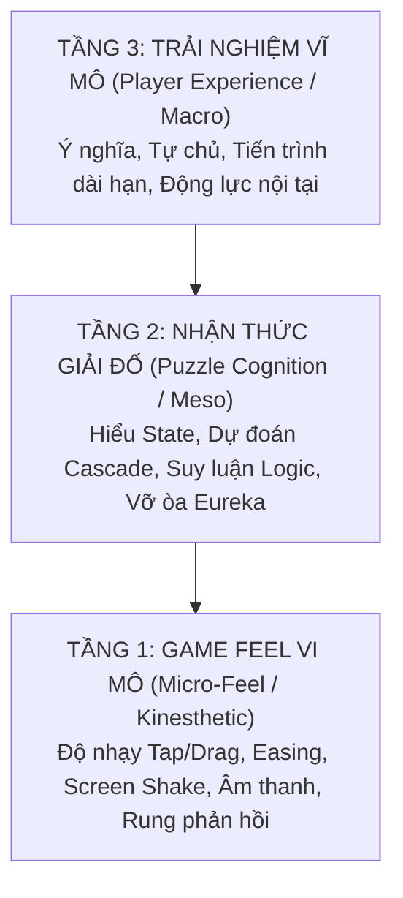
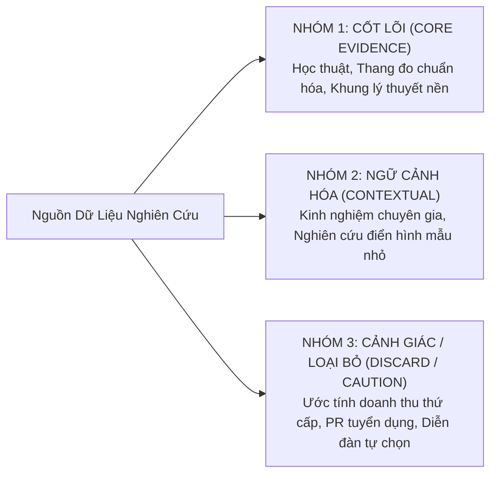
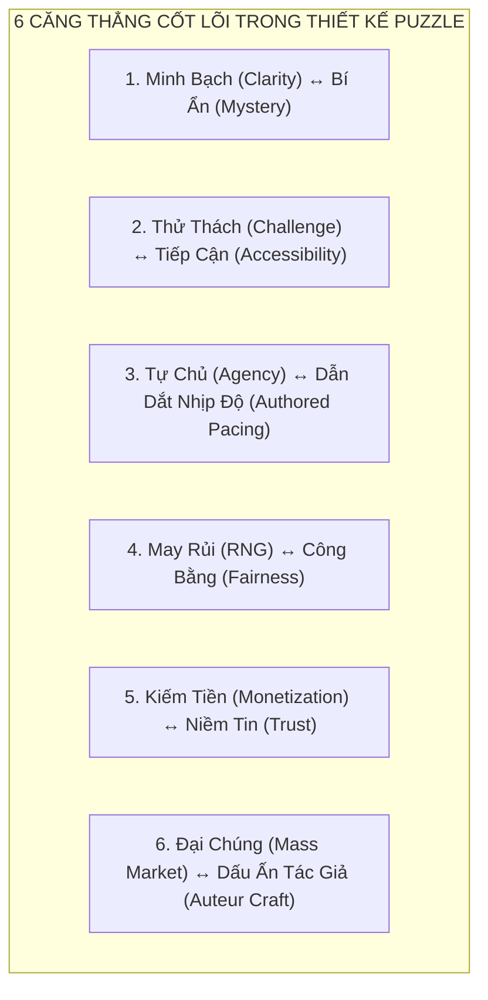
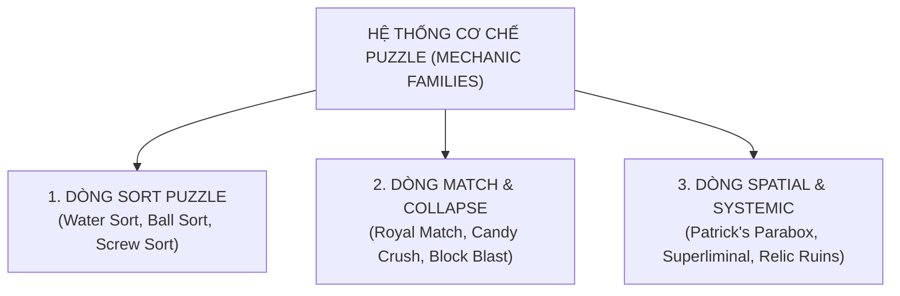
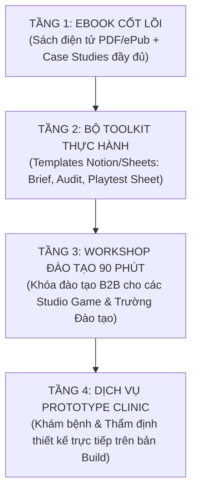
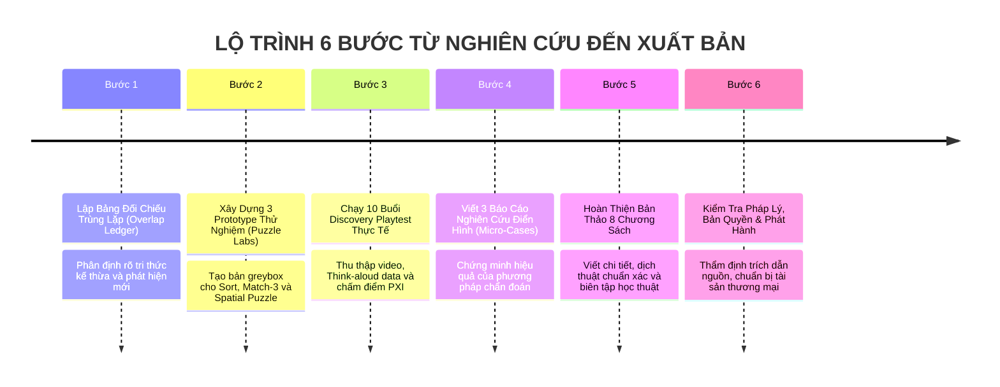

# The Art of Feeling — Tổng Hợp Tri Thức Chuyên Sâu, Phản Tỉnh Học Thuật & Chiến Lược Ebook

> **Phiên bản cập nhật:** 18-08-2026  
> **Mục đích tài liệu:** Đây là bản tổng hợp kiến thức toàn diện (*Master Synthesis*), hệ thống hóa toàn bộ tri thức chuyên ngành, khung lý thuyết, phản tỉnh phương pháp luận (*Epistemological Audit*), giải nghĩa thuật ngữ và xây dựng chiến lược hoàn chỉnh cho dự án Ebook **"The Art of Feeling: Designing Puzzle Games Players Trust"**.  
> **Nguyên tắc bản quyền & học thuật:** Tài liệu diễn giải và phân tích bằng tiếng Việt toàn bộ hệ thống tri thức; không sao chép nguyên văn các tác phẩm thương mại có bản quyền; mọi trích dẫn, số liệu và luận điểm đều được ghi chú nguồn, dịch nghĩa và đánh giá mức độ tin cậy rõ ràng ở cuối tài liệu.

---

## MỤC LỤC TỔNG QUAN

1. [Bảng Thuật Ngữ Chuyên Ngành & Know-how Nền Tảng (Terminology & Core Know-how)](#1-bảng-thuật-ngữ-chuyên-ngành--know-how-nền-tảng)
2. [Luận Đề Trung Tâm & Cấu Trúc 3 Lớp Cảm Giác (Core Thesis & 3-Tier Feeling Model)](#2-luận-đề-trung-tâm--cấu-trúc-3-lớp-cảm-giác)
3. [Đánh Giá & Phản Tỉnh Nguồn Dữ Liệu (Critical Reflection & Epistemological Audit)](#3-đánh-giá--phản-tỉnh-nguồn-dữ-liệu)
4. [Phản Biện Đa Nguyên & Các Căng Thẳng Thiết Kế (Pluralistic Critique & Core Design Tensions)](#4-phản-biện-đa-nguyên--các-căng-thẳng-thiết-kế)
5. [Hệ Thống Puzzle: Từ Trải Nghiệm Nhận Thức Đến Kinh Tế Bền Vững](#5-hệ-thống-puzzle-từ-trải-nghiệm-nhận-thức-đến-kinh-tế-bền-vững)
6. [Khảo Sát Thị Trường & Giải Phẫu Cơ Chế Theo Nhóm Game (Mechanic Families)](#6-khảo-sát-thị-trường--giải-phẫu-cơ-chế-theo-nhóm-game)
7. [Bộ Khung Chẩn Đoán Độc Quyền Của Ebook (Diagnostic Frameworks & Core IP)](#7-bộ-khung-chẩn-đoán-độc-quyền-của-ebook)
8. [Chiến Lược Xuất Bản & Cấu Trúc Ebook 8 Chương](#8-chiến-lược-xuất-bản--cấu-trúc-ebook-8-chương)
9. [Mô Hình Kinh Doanh & Lộ Trình Triển Khai Thực Tế](#9-mô-hình-kinh-doanh--lộ-trình-triển-khai-thực-tế)
10. [Danh Mục Tài Liệu Tham Khảo & Trích Dẫn Toàn Văn (References)](#10-danh-mục-tài-liệu-tham-khảo--trích-dẫn-toàn-văn)

---

## 1. BẢNG THUẬT NGỮ CHUYÊN NGÀNH & KNOW-HOW NỀN TẢNG

Để người đọc và nhà phát triển có đầy đủ **know-how** (tri thức thực hành chuẩn xác) trước khi bước vào phân tích thiết kế, phần này tập hợp và giải thích chi tiết toàn bộ các khái niệm chuyên ngành từ Tâm lý học nhận thức (*Cognitive Psychology*), Thiết kế Game (*Game Design*), Trải nghiệm người dùng (*UX/Accessibility*) và Kinh tế Game (*Game Economics*).

### 1.1. Nhóm Nhận Thức & Tâm Lý Học Puzzle (Puzzle Cognition)

| Thuật ngữ gốc (English) | Dịch nghĩa tiếng Việt | Định nghĩa & Bản chất cơ chế | Ý nghĩa trong Puzzle Game & Know-how thực hành |
|---|---|---|---|
| **Mental Model** | *Mô hình tinh thần* | Bản đồ nhận thức nội tâm mà người chơi tự xây dựng trong đầu về cách thế giới game và các quy tắc vận hành. | Người chơi không tương tác trực tiếp với code của game, họ tương tác với *mô hình tinh thần* của họ về game. Mọi thiết kế tốt đều nhằm giúp người chơi xây dựng mô hình này nhanh, đúng và không bị đánh lừa. |
| **Affordance** | *Khả năng gợi mở hành động* | Thuộc tính trực quan của một vật thể cho người chơi biết ngay lập tức vật đó có thể làm được gì (ví dụ: nút bấm thì gợi ý nhấn, tay cầm thì gợi ý kéo). | Khối hình có khe rãnh gợi ý trượt; ống nghiệm có miệng mở gợi ý rót nước. Nếu một vật nhìn như kéo được nhưng thực tế chỉ bấm được, đó là *False Affordance* (gợi mở sai lệch) gây ức chế. |
| **Signifier** | *Dấu hiệu chỉ dẫn* | Tín hiệu thị giác/âm thanh/chữ viết cụ thể nhằm thông báo vị trí, trạng thái hoặc hướng dẫn cách thực hiện hành động. | Mũi tên nhấp nháy, viền phát sáng, biểu tượng ổ khóa trên ô chứa. Designer phải đảm bảo signifier nổi bật nhưng không làm mất đi niềm vui tự khám phá. |
| **Feedforward** | *Phản hồi dự báo trước hành động* | Thông tin trực quan/âm thanh cung cấp cho người chơi biết kết quả *sắp xảy ra* trước khi họ thực sự xác nhận nước đi (preview/path preview). | Trong *Candy Crush* hay *Match-3*, khi kéo một viên kẹo, game làm sáng trước hàng 3 viên sẽ nổ. Trong *Water Sort*, khi chạm vào ống, ống đích hợp lệ sẽ hơi nhấc lên hoặc phát sáng. |
| **Causal Feedback** | *Phản hồi nhân quả* | Tín hiệu xác nhận cho người chơi thấy rõ: *hành động nào* đã gây ra *thay đổi trạng thái nào* và *vì sao*. | Không chỉ làm nổ hoành tráng, phản hồi phải chỉ rõ nguyên nhân (VD: "Khối đá vỡ vì bạn đã ghép 4 viên màu xanh cạnh nó", chứ không nổ ngẫu nhiên làm người chơi ngơ ngác). |
| **Puzzle Trust** | *Niềm tin vào câu đố* | Trạng thái tâm lý khi người chơi tin tuyệt đối rằng: game đã cung cấp đủ thông tin để suy luận, luật chơi công bằng, và thất bại là do suy luận của bản thân chứ không phải do game lừa đảo/bắt nạp tiền. | Lời hứa danh dự của puzzle game: "Bạn thua là vì bạn chưa tìm ra insight, không phải vì game sắp đặt ngầm để ép bạn mua booster." |
| **Perceived Agency** | *Cảm giác làm chủ / Năng lực tự quyết định* | Mức độ mà người chơi cảm thấy chính ý chí và lựa chọn của họ tạo ra kết quả trong game, thay vì cảm giác bị game dắt mũi hay phó mặc cho may rủi. | Khi một chuỗi nổ liên hoàn (*cascade*) xảy ra, nếu người chơi cảm thấy "mình đã tính trước được nước này" thì agency rất cao. Nếu họ thấy "board tự nổ may mắn", agency bị triệt tiêu. |
| **Fiero / Eureka (Aha! Moment)** | *Khoảnh khắc thấu suốt / Vỡ òa chiến thắng* | Cảm xúc hưng phấn tột độ khi một nút thắt suy luận được khai thông, biến sự bế tắc trước đó thành lời giải tao nhã. | Trọng tâm trải nghiệm của puzzle. "Aha!" chỉ xuất hiện sau một khoảng ma sát nhận thức (*cognitive friction*) vừa đủ, không đến từ những câu đố quá dễ hoặc quá ngẫu nhiên. |
| **Learned Helplessness** | *Sự bất lực tập nhiễm* | Trạng thái tâm lý buông xuôi khi người chơi nhận thấy mọi nỗ lực suy luận đều không thể kiểm soát được kết quả (thường do RNG ngầm hoặc bẫy khó vô lý). | Khi người chơi thử 10 lần nhưng thua vì kẹo rơi ngẫu nhiên không thể đoán trước, họ ngừng suy nghĩ và chuyển sang bấm bừa hoặc xóa game. |
| **Combinatorial Depth vs. Artificial Difficulty** | *Độ sâu tổ hợp vs. Độ khó nhân tạo* | **Độ sâu tổ hợp:** Số lượng khả năng suy luận phong phú sinh ra từ các quy tắc đơn giản kết hợp với nhau. **Độ khó nhân tạo:** Làm khó người chơi bằng cách giấu thông tin, giới hạn thời gian quá gắt, ép nhớ số lượng lớn hoặc phụ thuộc vào may rủi. | Designer chân chính theo đuổi *Combinatorial Depth* (như cờ vua, *Baba Is You*, *Patrick's Parabox*), loại bỏ *Artificial Difficulty*. |

---

### 1.2. Nhóm Game Feel & Tương Tác Vi Mô (Micro-Feel & Kinesthetics)

| Thuật ngữ gốc (English) | Dịch nghĩa tiếng Việt | Định nghĩa & Bản chất cơ chế | Ý nghĩa trong Puzzle Game & Know-how thực hành |
|---|---|---|---|
| **Game Feel** | *Cảm giác tương tác trong game* | Trải nghiệm xúc cảm xuất hiện từ tương tác vật lý/vi mô tức thời giữa người chơi và hệ thống điều khiển của game (theo Steve Swink). | Cảm giác một khối hình "nặng", "đầm tay", một cú trượt "trơn tru", hay một âm thanh "giòn giã" khi ghép đúng. |
| **Tuning (Physicality)** | *Tinh chỉnh tham số vật lý* | Việc căn chỉnh các biến số vận động: gia tốc, vận tốc, độ nảy, độ trễ (*latency*), easing curves để tạo cảm giác cơ học chân thực. | Tinh chỉnh tốc độ nước chảy trong *Water Sort* hay độ trượt của viên ngọc trong *Match-3*. Quá nhanh thì mất cảm giác vật lý, quá chậm thì cản trở nhịp tư duy. |
| **Juicing (Amplification)** | *Tăng độ mọng nước / Khuếch đại phản hồi* | Bổ sung các hiệu ứng thị giác, âm thanh, rung (screen shake, particles, squash & stretch, SFX pop) để nhấn mạnh một sự kiện. | **Nguyên tắc cốt lõi:** Juice phải tỷ lệ thuận với tầm quan trọng của sự kiện (*Saliency Hierarchy*). Đừng làm rung màn hình dữ dội cho một nước đi bình thường. |
| **Streamlining (Support)** | *Tinh giản rào cản thao tác* | Loại bỏ các ma sát cơ học thừa thãi, hỗ trợ người chơi thực hiện ý đồ mượt mà nhất (auto-align, snapping, input buffering, smart undo). | Trong puzzle, người chơi cần dồn năng lượng vào *suy nghĩ*, không phải vào *canh chỉnh pixel*. Tính năng hút khối vào đúng ô (*snapping*) là streamlining bắt buộc. |
| **Embodiment / Kinesthetic Empathy** | *Sự nhập thân xúc giác* | Trạng thái người chơi cảm thấy đối tượng ảo trên màn hình như một phần mở rộng của cơ thể mình thông qua phản hồi xúc giác và hình ảnh. | Kéo một khối đá nặng thấy ngón tay chuyển động chậm lại kết hợp âm thanh nghiến đá trầm đục tạo cảm giác thể chất chân thực. |
| **Saliency Hierarchy** | *Hệ thống thứ bậc tín hiệu* | Quy tắc phân cấp độ nổi bật của các tín hiệu trên màn hình: thông tin cốt lõi (mục tiêu, blocker) phải rõ nhất; hiệu ứng phụ không được che khuất bàn cờ. | Khi board đang có hiệu ứng combo nổ, người chơi vẫn phải nhìn thấy rõ các ô bị khóa và số lượt đi còn lại (*move counter*). |

---

### 1.3. Nhóm Khung Thiết Kế & Phương Pháp Đo Lường (Frameworks & Metrics)

| Thuật ngữ gốc (English) | Dịch nghĩa tiếng Việt | Định nghĩa & Bản chất cơ chế | Ý nghĩa trong Puzzle Game & Know-how thực hành |
|---|---|---|---|
| **MDA Framework** | *Khung Cơ chế - Động lực - Thẩm mỹ* | Mô hình phân tích game từ 3 góc độ: **Mechanics** (Quy tắc/Code) → **Dynamics** (Hành vi runtime khi người chơi tương tác) → **Aesthetics** (Cảm xúc/Trải nghiệm đích). | Designer xây *Mechanics*, nhưng người chơi trải nghiệm *Aesthetics* trước. Để tạo ra cảm giác "Aha!", designer phải tinh chỉnh Mechanics để sinh ra Dynamics suy luận logic. |
| **PXI (Player Experience Inventory)** | *Bộ thang đo trải nghiệm người chơi* | Công cụ khảo sát chuẩn hóa khoa học (Abeele et al.) đo lường 10 biến trải nghiệm: *Autonomy, Competence/Mastery, Curiosity, Immersion, Audiovisual Appeal, Clarity, Challenge, Progress Feedback, Meaning, Control*. | Dùng để đo lường định lượng sau playtest. Nếu điểm *Clarity* thấp trong khi *Challenge* cao vô lý, level đó đang gây bực bội vì mơ hồ chứ không phải vì câu đố hay. |
| **Puzzle Contract** | *Giao ước câu đố* | Thỏa thuận bất thành văn giữa người thiết kế và người chơi: designer cam kết không dùng luật ngầm, cung cấp đủ dữ kiện; người chơi cam kết vận dụng trí tuệ để giải. | Phá vỡ giao ước (ví dụ: bẫy chết người không báo trước, lời giải dựa trên lỗi game) sẽ phá hủy hoàn toàn niềm tin của người chơi. |
| **Cognitive Flow** | *Dòng chảy nhận thức* | Trạng thái tập trung sâu khi độ khó của thử thách cân bằng hoàn hảo với kỹ năng hiện tại của người chơi trong một môi trường phản hồi rõ ràng. | Trong puzzle, flow bị cắt đứt bởi hai thứ: quá dễ gây buồn ngủ, hoặc luật mập mờ gây ức chế (*confusion friction*). |
| **Think-Aloud Protocol** | *Giao thức suy nghĩ thành tiếng* | Phương pháp playtest yêu cầu người chơi liên tục nói ra những gì họ đang thấy, đang dự đoán và lý do họ chọn nước đi tiếp theo. | Công cụ số 1 để bắt lỗi *Mental Model*: phát hiện chính xác người chơi hiểu lầm quy tắc ở giây thứ mấy. |

---

### 1.4. Nhóm Thiết Kế Độ Khó & Kinh Tế F2P (Difficulty & Monetization)

| Thuật ngữ gốc (English) | Dịch nghĩa tiếng Việt | Định nghĩa & Bản chất cơ chế | Ý nghĩa trong Puzzle Game & Know-how thực hành |
|---|---|---|---|
| **Blockers / Obstacles** | *Chướng ngại vật bàn cờ* | Các phần tử tĩnh hoặc động trên bàn cờ đòi hỏi điều kiện triệt tiêu cụ thể (ví dụ: băng tuyết cần match cạnh bên, xích sắt cần 2 lần nổ). | King phân loại blockers thành: *Fixed* (đứng yên), *Spreading* (lan rộng như sô-cô-la), *Absorbing* (hút lượt). Blockers là nguồn lái độ khó chính trong casual puzzle. |
| **Cascade Effect** | *Hiệu ứng thác đổ / Nổ dây chuyền* | Hiện tượng các phần tử rơi tự do sau khi một nhóm bị triệt tiêu, tự động kích hoạt thêm các chuỗi match tiếp theo. | Cung cấp phần thưởng thị giác cực lớn (*audiovisual payoff*), nhưng nếu cascade quá dài sẽ làm giảm *Perceived Agency* vì người chơi thấy game tự chơi. |
| **Dynamic Difficulty Adjustment (DDA)** | *Điều chỉnh độ khó động* | Thuật toán can thiệp ngầm vào tham số game (tỷ lệ rơi kẹo tốt, cấp thêm lượt) dựa trên chuỗi thắng/thua của người chơi. | **Cảnh báo đạo đức:** DDA nếu bị lạm dụng để tạo "gần thắng" (*near-miss*) nhằm ép mua lượt sẽ biến game thành cờ bạc ngụy trang (*Dark Pattern*). |
| **Information Asymmetry** | *Bất đối xứng thông tin* | Tình trạng nhà phát triển nắm toàn bộ thuật toán sinh bàn cờ, xác suất rơi và tỷ lệ thắng, trong khi người chơi hoàn toàn mù mờ. | Xóa bỏ bất đối xứng có hại (công khai rõ xác suất, cơ chế booster) là điều kiện tiên quyết để duy trì *Puzzle Trust*. |
| **Value Exchange vs. Value Extraction** | *Trao đổi giá trị vs. Bòn rút giá trị* | **Value Exchange:** Người chơi trả tiền/xem quảng cáo vì trân trọng nội dung, mua sự tiện lợi, thẩm mỹ hoặc mở rộng trải nghiệm. **Value Extraction:** Cố tình tạo bế tắc giả, chặn luật chơi để ép người chơi trả tiền mới qua được. | Ebook bảo vệ mô hình *Value Exchange* bền vững; lên án mạnh mẽ *Value Extraction* ngắn hạn. |

---

## 2. LUẬN ĐỀ TRUNG TÂM & CẤU TRÚC 3 LỚP CẢM GIÁC

### 2.1. Luận Đề Trung Tâm: "Puzzle Trust"

Một trò chơi giải đố (*puzzle game*) có "feeling" xuất sắc không đơn thuần là nhờ hiệu ứng nổ lung linh (*visual polish*), âm thanh bắt tai hay chuỗi phần thưởng dồn dập. Cảm giác thỏa mãn sâu sắc nhất của puzzle xuất hiện khi người chơi **liên tục xây dựng và kiểm chứng thành công một mô hình nhận thức đúng đắn về trò chơi**:

```text
[Quan Sát Trạng Thái (State)] 
         ↓
[Hình Thành Dự Đoán (Prediction)] 
         ↓
[Cam Kết Nước Đi (Action / Input)] 
         ↓
[Phản Hồi Nhân Quả Rõ Ràng (Causal Feedback)] 
         ↓
[Cập Nhật Hiểu Biết Mới (Mental Model Update)] 
         ↓
[Khao Khát Chinh Phục Thử Thách Mới (Mastery Loop)]
```

Trọng tâm của mối quan hệ này chính là **Puzzle Trust (Niềm tin vào câu đố)**: Người chơi tin tưởng rằng mọi dữ kiện cần thiết đều đã được phơi bày công khai trên bàn cờ, luật chơi nhất quán, hệ thống tôn trọng ý chí của họ, và mỗi thất bại đều là một bài học trí tuệ giá trị chứ không phải một chiếc bẫy thương mại được lập trình sẵn để ép mua vật phẩm.

---

### 2.2. Mô Hình 3 Lớp Cảm Giác (3-Tier Feeling Framework)

Để tránh tình trạng đánh đồng giữa "đồ họa mượt" với "thiết kế hay", ebook phân tách trải nghiệm cảm xúc trong puzzle game thành 3 tầng cấu trúc độc lập nhưng tương hỗ chặt chẽ:



| Lớp Trải Nghiệm | Câu Hỏi Trọng Tâm Của Người Chơi | Thành Phần Cấu Thành Trong Puzzle | Nguy Cơ Khi Nhầm Lẫn / Đánh Đồng |
|---|---|---|---|
| **1. Game Feel Vi Mô** *(Micro-Feel / Kinesthetics)* | *Thao tác vật lý và phản hồi nghe-nhìn có mượt mà, đầm tay và dễ chịu không?* | Độ nhạy cảm ứng (*touch latency*), độ trượt (*inertia*), hiệu ứng hạt (*particles*), âm thanh gõ/nổ (*SFX*), độ rung (*haptics*), hiệu ứng đàn hồi (*squash & stretch*). | **Ngụy biện "Thao tác mượt = Game hay":** Tưởng rằng chỉ cần thêm hiệu ứng nổ đẹp và rung lắc là đã có game xuất sắc, bỏ quên lỗi logic bàn cờ. |
| **2. Nhận Thức Giải Đố** *(Puzzle Cognition / Meso)* | *Tôi có hiểu rõ trạng thái bàn cờ, quy tắc vận hành và hệ quả của nước đi không?* | Khả năng đọc chướng ngại vật (*blocker legibility*), suy luận nước đi tổ hợp, phân tích chuỗi nổ (*cascade prediction*), sử dụng tính năng đi lại (*undo*). | **Ngụy biện "Khó là sâu":** Nhầm lẫn giữa sự bế tắc do luật chơi mập mờ (*confusion*) với thử thách trí tuệ thực thụ (*intellectual challenge*). |
| **3. Trải Nghiệm Vĩ Mô** *(Macro Player Experience)* | *Tôi có cảm thấy tự chủ, tiến bộ, tò mò và gắn kết ý nghĩa lâu dài không?* | Đường cong tiến trình (*progression curve*), nhịp độ màn chơi (*level pacing*), câu chuyện dẫn dắt (*narrative context*), sự kiện cộng đồng (*live events*). | **Ngụy biện "Retention cao = Cảm xúc tốt":** Dùng các thủ thuật tâm lý ép người chơi quay lại bằng nỗi sợ bỏ lỡ (*FOMO*) thay vì niềm vui làm chủ thực sự. |

---

## 3. ĐÁNG GIÁ & PHẢN TỈNH NGUỒN DỮ LIỆU (EPISTEMOLOGICAL AUDIT)

Một tài liệu nghiên cứu nghiêm túc phải có tính **phản tỉnh (critical reflection)**: chỉ rõ nguồn dữ liệu nào có giá trị khoa học vững chắc để làm nền móng lý thuyết, nguồn nào chỉ mang tính tham khảo ngữ cảnh sản xuất, và nguồn nào **đề xuất loại bỏ hoặc tuyệt đối không dùng làm bằng chứng nhân quả**.

### 3.1. Bảng Phản Tỉnh & Đánh Giá Toàn Diện Các Cụm Nguồn



| Cụm Nguồn & Tài Liệu | Bản Chất & Đóng Góp Thực Sự | Giới Hạn Phương Pháp Luận & Nguy Cơ Suy Diễn | Quyết Định & Đề Xuất Áp Dụng Cho Ebook | Mức Độ Tin Cậy |
|---|---|---|---|---|
| **Pichlmair & Johansen (2020/2022)**, *Designing Game Feel. A Survey*[^s1] | **Học thuật xuất sắc:** Chuẩn hóa hệ thống từ vựng về Game Feel từ hơn 200 tài liệu; phân loại thành 3 trục: *Physicality, Amplification, Support*. | Đây là bài tổng quan lý thuyết (*meta-survey*), không phải nghiên cứu thực nghiệm đo lường trên người chơi thật. Trục "Clarity" chưa được kiểm chứng độc lập. | **DÙNG LÀM XƯƠNG SỐNG TỪ VỰNG:** Tiếp thu 3 trục để phân tích vi mô; bổ sung tầng *Intelligibility* dành riêng cho Puzzle. | **Hạng A** *(Core)* |
| **Steve Swink (2009)**, *Game Feel: A Game Designer's Guide*[^swink] | **Kinh điển về tương tác:** Đặt nền móng về *Virtual Sensation* và mô hình tương tác 6 thành phần: *Input, Response, Context, Polish, Metaphor, Rules*. | Tập trung sâu vào Action/Platformer thời gian thực (Mario, Asteroids); không giải quyết bài toán suy luận tổ hợp theo lượt (*Turn-based inference*). | **KẾ THỪA CÓ CHỌN LỌC:** Dùng mô hình 6 thành phần làm hệ quy chiếu vi mô; không lấy làm mô hình tổng thể cho toàn bộ puzzle. | **Hạng A** *(Core)* |
| **Hunicke, LeBlanc & Zubek (2004)**, *MDA Framework*[^mda] | **Khung phân tích kinh điển:** Thiết lập cầu nối chặt chẽ giữa *Mechanics* (Thiết kế) → *Dynamics* (Hành vi runtime) → *Aesthetics* (Cảm xúc). | Không phải công thức toán học dự báo chính xác cảm xúc cá nhân của từng tập người chơi; mang tính định tính cao. | **DÙNG LÀM BỘ KHUNG TỔNG QUÁT:** Làm xương sống cho bản đồ quan hệ nhân quả từ quy tắc bàn cờ đến cảm xúc người chơi. | **Hạng A** *(Core)* |
| **Abeele et al. (2020)**, *PXI (Player Experience Inventory)*[^pxi] | **Thang đo chuẩn hóa:** Hệ thống câu hỏi khoa học đã qua kiểm định giá trị thống kê để đo lường 10 biến trải nghiệm game. | Khảo sát sau chơi (*retrospective survey*) không ghi nhận được biến thiên nhận thức tại từng giây cụ thể trong lúc giải đố. | **DÙNG ĐỂ ĐO LƯỜNG ĐỊNH LƯỢNG:** Ứng dụng PXI trong các buổi playtest đối chứng trước và sau khi tinh chỉnh thiết kế. | **Hạng A** *(Core)* |
| **Jesse Schell**, *The Art of Game Design: A Book of Lenses*[^schell] | **Bộ công cụ chẩn đoán đa chiều:** Hệ thống câu hỏi phản tỉnh (*Lenses*) giúp đội ngũ đổi mới góc nhìn khi bế tắc thiết kế. | Các lens mang tính bao quát toàn ngành; nếu sao chép nguyên xi sẽ biến ebook thành sách game design chung chung. | **LỌC LỰA LENS PUZZLE:** Chỉ trích xuất và phát triển sâu các lens về *Puzzle, Challenge, Choice, Interface, Guidance, Playtest*. | **Hạng A/B** *(Selective)* |
| **King GDC Talk (2020)**, *Blockers & Difficulty Drivers in Candy Crush*[^s5] | **Tri thức sản xuất đỉnh cao:** Phân loại khoa học hệ thống blockers và cách vận hành độ khó trong casual puzzle quy mô lớn. | Là kinh nghiệm thực hành (*practitioner wisdom*) của một studio cụ thể với mô hình F2P thương mại; mang thiên hướng tối ưu hóa kinh doanh. | **DÙNG LÀM CASE STUDY SẢN XUẤT:** Tiếp thu cách phân loại blocker; cảnh giác trước việc sao chép các cơ chế bóp nghẹt độ khó. | **Hạng B** *(Contextual)* |
| **Daniel Wewerinke (GDC 2024)**, *Relic Ruins - Environmental Puzzles*[^relic] | **Quy trình thiết kế thực tế:** Hướng dẫn chi tiết cách xây dựng câu đố môi trường, quy tắc dạy luật và ghi hình playtest bắt lỗi tư duy. | Case study độc lập, áp dụng cho game giải đố môi trường 3D; không đại diện cho casual mobile. | **DÙNG LÀM BÀI HỌC THIẾT KẾ MẪU:** Trích xuất phương pháp playtest và quy tắc phân tầng gợi ý (*tiered hint system*). | **Hạng B** *(Contextual)* |
| **Nghiên cứu học thuật Thổ Nhĩ Kỳ & Quốc tế mẫu nhỏ** (Akel 2023[^turkey-casual], Berkman 2020[^turkey-vr], Superliminal 2024[^turkey-superliminal]) | **Gợi mở góc nhìn đặc thù:** So sánh UX casual mobile, đo lường chênh lệch giữa VR và Desktop trong *Keep Talking and Nobody Explodes*, giải phẫu không gian 3D. | Quy mô mẫu rất nhỏ (7 - 34 người), dùng phương pháp tự báo cáo (*self-report*); không đủ độ tin cậy để khái quát hóa thành quy luật phổ quát. | **DÙNG LÀM NGỮ CẢNH & PHẢN VÍ DỤ:** Minh chứng cho việc "độ chìm đắm cao chưa chắc đem lại hiệu năng giải đố tốt"; không dùng làm chân lý định lượng. | **Hạng B/C** *(Conditional)* |
| **Nguồn Tuyển dụng / Phỏng vấn Việt Nam** (Lihuhu Game Designer JD[^lihuhu], RMIT/Gameloft Game Talks[^gametalk]) | **Góc nhìn thực tế ngành game nội địa:** Cho thấy quy trình vận hành casual puzzle tại VN tập trung vào *pacing, flow, win/lose rate, retry, playtest*. | Tài liệu mô tả công việc (*job description*) và bài báo truyền thông không phải là tài liệu nghiên cứu khoa học có bình duyệt. | **DÙNG ĐỂ CHUYỂN NGỮ THỰC TIỄN:** Cầu nối thuật ngữ giúp framework học thuật dễ hiểu và áp dụng được ngay với đội ngũ sản xuất game Việt Nam. | **Hạng C** *(Local Context)* |
| **Báo cáo ước tính thị trường thứ cấp** (Naavik Match-3/Merge 2025[^market-naavik], AppMagic Publisher Estimates[^market-publishers], Udonis[^gossip], Balancy[^blockblast]) | **Bức tranh toàn cảnh thương mại:** Cung cấp số liệu ước lượng về quy mô doanh thu IAP, top game dẫn đầu thị trường (*Royal Match, Gossip Harbor, Block Blast*). | Dữ liệu mô hình hóa thứ cấp, loại trừ doanh thu quảng cáo (*AdRev*), web shop và kênh bên thứ ba; không có dữ liệu người dùng gốc. | **CẢNH BÁO / KHÔNG DÙNG LÀM BẰNG CHỨNG KHOA HỌC:** Chỉ dùng để định vị bối cảnh thị trường; tuyệt đối không dùng số liệu ước tính để chứng minh tính đúng đắn của thiết kế. | **Hạng C** *(Market Signal Only)* |
| **Bình luận trên Diễn đàn / Cộng đồng Game** (King Community Feedback về Candy Crush[^s10][^s11]) | **Phát hiện rào cản thực tế:** Nêu bật các vấn đề người chơi thật gặp phải về mù màu (*color-blindness*), hiệu ứng chớp gây mỏi mắt, cảm giác bị game ép thua. | Mẫu tự chọn (*self-selected sample*), mang tính thiên lệch cao từ nhóm người chơi bức xúc; không đại diện cho số đông tĩnh lặng. | **ĐỀ XUẤT LOẠI BỎ LÀM CHÂN LÝ - CHỈ DÙNG TẠO GIẢ THUYẾT:** Dùng để xây dựng bộ tiêu chí kiểm tra khả năng tiếp cận (*Accessibility Checklist*); không lấy làm luận cứ kết luận. | **Hạng C** *(Hypothesis Only)* |

---

## 4. PHẢN BIỆN ĐA NGUYÊN & CÁC CĂNG THẲNG THIẾT KẾ

Trong thiết kế game hiện đại, không tồn tại một "người chơi trung bình", không có một định nghĩa duy nhất về sự thỏa mãn, và không có một quyết định thiết kế nào là hoàn toàn miễn phí. Ebook lựa chọn đối diện trực tiếp với **6 trục căng thẳng cốt lõi**:



### 4.1. Ma Trận 6 Trục Căng Thẳng & Giải Pháp Cân Bằng

| Trục Căng Thẳng | Lập Luận Phía A | Lập Luận Phía B | Giải Pháp Cân Bằng Thực Hành Cho Ebook |
|---|---|---|---|
| **1. Clarity ↔ Mystery** *(Rõ ràng vs. Bí ẩn)* | Mọi thứ quá rõ ràng sẽ triệt tiêu cảm giác tò mò và niềm vui khám phá bất ngờ. | Luật chơi và trạng thái mập mờ sẽ phá hủy khả năng suy luận logic của người chơi. | **Công khai 100% Luật & Trạng thái quan sát được (Observable State); giấu kín Không gian kết hợp & Lời giải tao nhã (Insight/Combination).** |
| **2. Challenge ↔ Accessibility** *(Thử thách vs. Tiếp cận)* | Game phải khó, gắt gao thì chiến thắng mới đem lại cảm giác tự hào tột độ (*Fiero*). | Rào cản giác quan/thao tác quá cao sẽ loại bỏ nhóm người chơi hạn chế vận động/thị giác. | **Giữ nguyên độ sâu bài toán trí tuệ; mở rộng đa kênh tín hiệu (màu + hình dạng + âm thanh), cung cấp hệ thống gợi ý nhiều tầng và tính năng Undo.** |
| **3. Agency ↔ Authored Pacing** *(Tự do vs. Đạo diễn)* | Người chơi cần toàn quyền tự do thử nghiệm mọi hướng đi theo ý chí cá nhân. | Tự do tuyệt đối dễ gây lạc lối, loãng trải nghiệm; cần bàn tay đạo diễn dẫn dắt cảm xúc. | **Cho phép nhiều đường giải hợp lệ (*Multiple Valid Solutions*), nhưng kiểm soát chặt chẽ thứ tự giới thiệu quy tắc mới và độ phức tạp.** |
| **4. RNG ↔ Fairness** *(Ngẫu nhiên vs. Công bằng)* | Yếu tố may rủi sinh ra bất ngờ, biến số mới và giá trị chơi lại (*Replayability*). | May rủi không thể kiểm soát sẽ tạo ra sự bất lực tập nhiễm (*Learned Helplessness*). | **Chỉ áp dụng RNG khi người chơi hiểu rõ phân phối xác suất, có công cụ hóa giải (*Counterplay*) hoặc đưa ra đánh đổi có tính toán.** |
| **5. Monetization ↔ Trust** *(Kiếm tiền vs. Niềm tin)* | Doanh thu IAP/Quảng cáo là huyết mạch để duy trì live-ops và sản xuất nội dung mới. | Cố tình tạo bế tắc giả để ép trả tiền sẽ hủy hoại hoàn toàn *Puzzle Trust*. | **Thu tiền từ sự tiện lợi, thẩm mỹ, biểu đạt cá nhân hoặc mở rộng nội dung; tuyệt đối không bán quyền được hiểu luật chơi cơ bản.** |
| **6. Mass Market ↔ Auteur Craft** *(Thị trường vs. Tác giả)* | Game đại chúng cần luật cực đơn giản, nhịp chơi nhanh, vòng lặp gây nghiện tức thì. | Game tác giả tỏa sáng nhờ ý tưởng đột phá, cơ chế độc bản và độ nén tư duy sâu sắc. | **Tách biệt "Hợp đồng cốt lõi" (Core Contract - minh bạch, dễ tiếp cận) khỏi "Dấu ấn tri thức" (Signature Insight - sự độc đáo riêng).** |

---

### 4.2. Phê Bình 5 Ngụy Biện Phổ Biến Trong Ngành Game

1. **Ngụy biện 1: "Càng nhiều Juice (hiệu ứng) thì game càng hay."**  
   *Sự thật:* Hiệu ứng chỉ có giá trị khi nó làm nổi bật một *thay đổi trạng thái thực sự* trên bàn cờ. Nếu một nước đi bình thường cũng làm rung chuyển màn hình, hệ thống thứ bậc tín hiệu (*Saliency Hierarchy*) sẽ sụp đổ, biến phản hồi thành sự nhiễu loạn thị giác.
2. **Ngụy biện 2: "Game càng khó thì chứng tỏ gameplay càng sâu sắc."**  
   *Sự thật:* Độ khó có thể sinh ra từ 4 nguồn: (a) Độ sâu tổ hợp quy tắc, (b) Thiếu thông tin dữ kiện, (c) Thao tác điều khiển vụng về, (d) Bắt ép ghi nhớ quá tải. Chỉ có nguồn (a) mới tạo ra cảm giác thấu suốt *Aha!*. Ba nguồn sau là lỗi thiết kế nghiêm trọng cần loại bỏ.
3. **Ngụy biện 3: "Dữ liệu chỉ số (Metrics) luôn phản ánh sự thật tuyệt đối."**  
   *Sự thật:* Tỷ lệ chơi lại (*Retry Rate*) cao có thể là do người chơi say mê thử nghiệm giả thuyết mới, nhưng cũng có thể là do họ đang ức chế tột cùng vì một difficulty spike vô lý. Mọi con số định lượng đều phải được đối chiếu bằng video quan sát hành vi và suy nghĩ thành tiếng (*Think-aloud protocol*).
4. **Ngụy biện 4: "Người chơi luôn nói chính xác điều họ muốn."**  
   *Sự thật:* Người chơi là chuyên gia tuyệt đối về *cảm xúc của họ* (họ thấy vui, chán hay bực), nhưng hiếm khi là chuyên gia về *nguyên nhân thiết kế*. Khi người chơi bảo "Màn này cần thêm lượt đi", nguyên nhân gốc rễ thường là do một blocker xuất hiện mà không có hướng dẫn rõ ràng.
5. **Ngụy biện 5: "Game có doanh thu cao nhất chính là game có thiết kế chuẩn mực nhất."**  
   *Sự thật:* Doanh thu là hàm số tổng hòa của marketing (UA), vận hành trực tiếp (Live-ops), thương hiệu, định giá và chiến lược kinh doanh. Sao chép mù quáng một tính năng kiếm tiền của top game mà không hiểu hệ sinh thái đi kèm sẽ phá hủy trải nghiệm cốt lõi của game mình.

---

## 5. HỆ THỐNG PUZZLE: TỪ TRẢI NGHIỆM NHẬN THỨC ĐẾN KINH TẾ BỀN VỮNG

### 5.1. Hai Vòng Lặp Phản Hồi Đối Nghịch

Một dự án game giải đố vận hành như một hệ sinh thái khép kín. Cách studio lựa chọn đối xử với người chơi sẽ quyết định game rơi vào **Vòng lặp Lành mạnh** hay **Vòng lặp Độc hại**:

```mermaid
graph TD
    subgraph VIRTUOUS["VÒNG LẶP LÀNH MẠNH (VIRTUOUS CYCLE)"]
        V1["Minh Bạch Luật & Trạng Thái"] --> V2["Học Hỏi & Thấu Suốt (Aha!)"]
        V2 --> V3["Làm Chủ Kỹ Năng (Mastery)"]
        V3 --> V4["Tự Nguyện Quay Lại & Gắn Kết"]
        V4 --> V5["Dữ Liệu Đáng Tin Cậy"]
        V5 --> V6["Tối Ưu Level & Gợi Ý Tốt Hơn"]
        V6 --> V1
    end

    subgraph TOXIC["VÒNG LẶP ĐỘC HẠI (TOXIC EXTRACTION CYCLE)"]
        T1["Luật Mập Mờ / Đột Biến Độ Khó"] --> T2["Ức Chế / Bất Lực Tập Nhiễm"]
        T2 --> T3["Bức Bách Mua Booster / Xem Ads"]
        T3 --> T4["Doanh Thu Tăng Ngắn Hạn"]
        T4 --> T5["Đội Ngũ Tăng Thêm Ma Sát Để Ép Trả"]
        T5 --> T6["Xói Mòn Niềm Tin (Trust Debt)"]
        T6 --> T7["Người Chơi Rời Bỏ & Tẩy Chay"]
    end
```



- **Vòng lặp Lành mạnh (Giá trị bền vững):** Minh bạch → Người chơi hiểu luật → Thấu suốt Eureka → Cảm giác tự hào làm chủ → Quay lại tự nguyện → Dữ liệu playtest chân thực → Cải tiến level chuẩn xác → Niềm tin gia tăng.
- **Vòng lặp Độc hại (Bòn rút ngắn hạn):** Tạo độ khó ảo/mơ hồ → Người chơi ức chế bế tắc → Ép nạp tiền qua màn → Doanh thu đột biến trong ngắn hạn → Đội ngũ tưởng bẫy hiệu quả nên tiếp tục tăng ma sát → Niềm tin cạn kiệt (*Trust Debt*) → Người chơi âm thầm rời bỏ (*Churn*).

---

### 5.2. Góc Nhìn Lý Thuyết Trò Chơi Trong Puzzle F2P

Trong kinh tế học game, mối quan hệ giữa nhà phát triển và người chơi trong game F2P là một **Trò chơi lặp lại nhiều lần (Repeated Game)**, không phải một canh bạc lừa đảo một lần.

| Khái Niệm Lý Thuyết Trò Chơi | Biểu Hiện Cụ Thể Trong Puzzle Game | Hàm Ý Thiết Kế & Nguyên Tắc Bảo Vệ |
|---|---|---|
| **Signaling (Phát tín hiệu)** | Giao diện, hướng dẫn, hoạt ảnh và mức giá phát đi tín hiệu về sự tôn trọng của studio đối với người chơi. | Tín hiệu phải nhất quán: Không thể tuyên bố "Game công bằng" nhưng lại ngầm cài thuật toán hạ thấp tỷ lệ rơi kẹo tốt khi người chơi sắp thắng. |
| **Information Asymmetry (Bất đối xứng thông tin)** | Studio biết trước thuật toán sinh bàn cờ và độ khó; người chơi chỉ nhìn thấy trạng thái hiện tại. | Giảm thiểu bất đối xứng độc hại: Công khai rõ cơ chế hoạt động của vật phẩm bổ trợ (*boosters*) và điều kiện thắng/thua. |
| **Commitment Devices (Cơ chế cam kết)** | Người chơi đầu tư thời gian, trí tuệ và tiền bạc; studio cam kết cung cấp trải nghiệm giải trí chất lượng và công bằng. | Đưa vào các tính năng bảo vệ cam kết: Cho phép đi lại nước đi (*Undo*), lưu tiến trình an toàn, hỗ trợ người khuyết tật. |
| **Principal-Agent Problem (Xung đột mục tiêu)** | Nhà phát triển/PM chịu áp lực KPI doanh thu ngắn hạn; người chơi tìm kiếm niềm vui và sự thỏa mãn dài hạn. | Thiết lập bảng chỉ số cân bằng: Đặt chỉ số *Tỷ lệ phàn nàn về độ mơ hồ* và *Mức độ hài lòng* ngang hàng với *Tỷ lệ chuyển đổi nạp tiền*. |
| **Repeated Cooperation (Hợp tác lặp lại)** | Người chơi chỉ tiếp tục mở ví khi họ cảm thấy các lần chi tiêu trước đó là xứng đáng và được tôn trọng. | Bán giá trị thặng dư (thời gian, trang trí, thử thách phụ); tuyệt đối không bán "chìa khóa giải mã sự mập mờ". |

---

## 6. KHẢO SÁT THỊ TRƯỜNG & GIẢI PHẪU CƠ CHẾ THEO NHÓM GAME

Ebook tiếp cận thị trường không phải để "sao chép công thức thành công", mà để **giải phẫu các bất biến trải nghiệm (*Experience Invariants*)** xuyên suốt các dòng game giải đố lớn.



### 6.1. Dòng Sort Puzzle (Water Sort, Ball Sort, Screw Sort, Hexa Sort)

- **Hạt nhân cơ chế:** Biến một trạng thái hỗn loạn ban đầu thành một trạng thái trật tự hoàn hảo thông qua các thao tác chuyển dịch có giới hạn về sức chứa và vị trí.
- **Feeling cốt lõi:** *"Tôi đang giải phóng không gian và lập lại trật tự cho một hệ thống; mỗi lần dọn sạch một ô chứa là không gian tư duy của tôi được mở rộng."*
- **Bất biến trải nghiệm bắt buộc phải giữ:**
  1. *Ràng buộc nhìn thấy được ngay:* Người chơi phải nhận ra ngay ô nào hợp lệ mà không cần thử-sai mù quáng.
  2. *Ô trống là tài nguyên chiến lược:* Cảm giác hồi hộp sinh ra từ việc cân nhắc có nên chiếm dụng ô chứa tạm thời hay không.
  3. *Hỗ trợ Undo mạnh mẽ:* Cho phép người chơi tự do thử nghiệm các nhánh suy luận mà không bị phạt vô lý.
- **Rủi ro phá hủy feeling:** Giấu màu dưới đáy mà không cho manh mối; animation rót nước quá chậm làm gãy nhịp tư duy; thêm quảng cáo chen ngang ngay khi người chơi đang tập trung suy nghĩ.

---

### 6.2. Dòng Match-3, Blast & Collapse (Royal Match, Candy Crush, Block Blast!)

- **Hạt nhân cơ chế:** Nhận diện mẫu hình (*pattern recognition*), hoán đổi hoặc chạm khối để triệt tiêu các phần tử cùng loại, kích hoạt hiệu ứng nổ dây chuyền (*cascade*) và phá hủy chướng ngại vật (*blockers*).
- **Feeling cốt lõi:** *"Tôi nhìn thấy trước một phản ứng dây chuyền tiềm năng; quyết định kích hoạt của tôi tạo ra một vụ nổ ngoạn mục giải phóng bàn cờ."*
- **Bất biến trải nghiệm bắt buộc phải giữ:**
  1. *Độ rõ của chướng ngại vật:* Nhìn vào biết ngay blocker cần mấy lần đánh và chịu tác động bởi cơ chế nào.
  2. *Cân bằng giữa Agency và Payoff:* Hiệu ứng dây chuyền phải mang lại cảm giác "do tôi phát hiện", không phải do thuật toán tự biên tự diễn.
  3. *Phản hồi nhân quả tức thì:* Mỗi combo nổ đều chỉ rõ nguồn gốc kích hoạt đầu tiên.
- **Rủi ro phá hủy feeling:** Lạm dụng thuật toán xếp kẹo ngầm để ép thua ở nước đi cuối cùng (*near-miss manipulation*); hiệu ứng nổ quá chói mắt che khuất trạng thái bàn cờ.

---

### 6.3. Dòng Spatial, Environmental & Systemic Puzzle (Patrick's Parabox, Superliminal, Relic Ruins)

- **Hạt nhân cơ chế:** Vận dụng quy luật không gian 3D, phối cảnh, tương tác vật lý hoặc đệ quy logic (*recursion*) để mở đường hoặc thay đổi trạng thái môi trường.
- **Feeling cốt lõi:** *"Một quy tắc thực tại vừa bị bẻ cong; sự thay đổi góc nhìn giúp tôi nhìn thấu cấu trúc vô hình của thế giới."*
- **Bất biến trải nghiệm bắt buộc phải giữ:**
  1. *Ngôn ngữ thị giác nhất quán:* Các vật thể có thể tương tác phải có dấu hiệu nhận biết đồng nhất trong toàn bộ không gian.
  2. *Môi trường an toàn để thử nghiệm:* Thất bại không bị trừng phạt bằng cái chết hay phải chạy lại một quãng đường dài.
  3. *Khoảnh khắc Aha! thuần khiết:* Lời giải đến từ việc thay đổi cách tư duy chứ không phải từ thao tác ngắm bắn chuẩn xác.

---

## 7. BỘ KHUNG CHẨN ĐOÁN ĐỘC QUYỀN CỦA EBOOK (CORE IP)

Đây là các công cụ thực hành độc quyền do Ebook cung cấp, giúp các nhóm phát triển chuyển hóa những nhận xét cảm tính thành các bài kiểm tra định lượng và hành động thiết kế cụ thể.

### 7.1. Khuôn Mẫu Tuyên Ngôn Cảm Xúc (Feeling Target Brief)

*Sử dụng trước khi bắt đầu vẽ wireframe hoặc viết code prototype:*

> **"Người chơi sẽ cảm thấy [CẢM XÚC / TRẠNG THÁI NĂNG LỰC ĐÍCH] khi họ tự mình nhận ra [QUY TẮC NGẦM / QUY LUẬT TỔ HỢP], chủ động thực hiện [HÀNH ĐỘNG CỤ THỂ], và nhìn thấy game xác nhận tức thì bằng [THAY ĐỔI TRẠNG THÁI + TÍN HIỆU PHÂN CẤP]. Khi gặp thất bại, họ biết chính xác [GIẢ THUYẾT NÀO CỦA MÌNH ĐÃ SAI VÀ CẦN THỬ LẠI ĐIỀU GÌ] mà không cần bất kỳ sự can thiệp trả phí nào."**

---

### 7.2. Bản Đồ Phản Hồi Nhân Quả (Causal Feedback Map)

*Sử dụng trong quá trình kiểm tra bản chơi thử (prototype):*

| Bước Phân Tích | Hành Vi & Trạng Thái Thực Tế | Câu Hỏi Kiểm Tra Chẩn Đoán Cốt Lõi | Hành Động Điều Chỉnh Nếu Lỗi |
|---|---|---|---|
| **1. Ý Định & Input** | Người chơi chạm/kéo đối tượng nào với mong muốn gì? | *Người chơi có thể nói rõ kỳ vọng của họ trước khi buông tay không?* | Nếu họ chạm bừa: Cải thiện dấu hiệu chỉ dẫn (*Signifiers*). |
| **2. Chuyển Đổi Trạng Thái** | Quy tắc logic nào trong code thực sự được thực thi? | *Có quy tắc ngầm hoặc yếu tố ngẫu nhiên nào làm đứt gãy mối liên hệ logic không?* | Nếu có luật ngầm: Loại bỏ hoặc làm rõ luật trong tutorial. |
| **3. Tín Hiệu Phát Ra** | Visual, Audio, Haptic và UI phản hồi điều gì? | *Tín hiệu có giúp người chơi phân biệt sự kiện quan trọng với hiệu ứng trang trí không?* | Nếu quá ồn ào: Căn chỉnh lại thứ bậc tín hiệu (*Saliency*). |
| **4. Cập Nhật Dự Đoán** | Người chơi tin điều gì sẽ xảy ra ở nước đi kế tiếp? | *Mô hình nhận thức của người chơi sau phản hồi có chính xác hơn trước đó không?* | Nếu vẫn mơ hồ: Bổ sung phản hồi dự báo trước (*Feedforward*). |

---

### 7.3. Bộ 15 Tiêu Chí Đánh Giá Niềm Tin Câu Đố (Puzzle Trust Audit)

*Đánh giá từng câu hỏi theo thang điểm: `[2] Hoàn toàn đạt | [1] Chưa rõ ràng / Cần cải thiện | [0] Hoàn toàn không đạt`*

1. **Mục tiêu rõ ràng:** Người chơi có thể đọc được ngay điều kiện thắng/thua trong vòng 3 giây đầu tiên không?
2. **Đa kênh tiếp cận:** Mỗi trạng thái quan trọng có ít nhất 2 kênh tín hiệu nhận biết (Hình dạng + Màu sắc / Âm thanh) không?
3. **Dự đoán trước hành động:** Trước khi ra quyết định, người chơi có thể dự đoán chính xác kết quả trực tiếp của nước đi không?
4. **Minh bạch nhân quả:** Sau khi thao tác, game có chỉ rõ chính xác quy tắc nào đã tạo ra kết quả đó không?
5. **Thất bại mang tính giáo dục:** Khi thua, người chơi có hiểu rõ giả thuyết nào của mình bị sai không?
6. **Hồi phục nhịp độ:** Tính năng Undo / Retry có giúp duy trì mạch tư duy mà không ép làm lại các thao tác cơ học nhàm chán không?
7. **Công bằng với yếu tố may rủi:** Mọi biến số ngẫu nhiên (RNG) có minh bạch, có công cụ hóa giải hoặc nằm ngoài vùng suy luận cốt lõi không?
8. **Hệ thống gợi ý phân tầng:** Gợi ý có mở theo từng bước (*Nhắc nhở → Chỉ điểm → Mở lời giải*) thay vì làm hộ ngay từ đầu không?
9. **Thứ bậc hiệu ứng:** Mức độ rực rỡ của hiệu ứng nghe-nhìn có tỷ lệ thuận tuyệt đối với tầm quan trọng của sự kiện không?
10. **Kiểm chứng bước nhảy độ khó:** Các màn chơi có độ khó đột biến (*Spike*) đã được kiểm chứng độc lập trên cả người mới lẫn người chơi quen chưa?
11. **Thời điểm thương mại văn minh:** Lời mời xem quảng cáo/mua đồ có xuất hiện sau một lựa chọn rõ ràng, thay vì chen ngang lúc bế tắc không?
12. **Bảo vệ quyền hiểu luật:** Người chơi có thể hiểu và làm chủ 100% luật chơi mà không bắt buộc phải mua bất kỳ vật phẩm nào không?
13. **Chỉ số đo lường niềm tin:** Bảng dữ liệu của studio có theo dõi các chỉ số về niềm tin (*tỷ lệ bối rối, điểm công bằng cảm nhận*) bên cạnh doanh thu không?
14. **Khả năng tiếp cận thể chất:** Một người chơi bị mù màu hoặc hạn chế vận động có thể hoàn thành trọn vẹn màn chơi không?
15. **Hành động thiết kế rõ ràng:** Đội ngũ có biết chính xác sau đợt playtest này sẽ thay đổi dòng code/thông số nào và tiêu chí vượt qua là gì không?

---

### 7.4. Bảng Mã Hóa Quan Sát Playtest (Qualitative Coding Sheet)

*Dùng cho Game Designer ghi chép trong các buổi kiểm thử người chơi trực tiếp:*

| Mã Quan Sát | Tên Danh Mục | Biểu Hiện Hành Vi Cụ Thể Của Người Chơi | Ý Nghĩa Chẩn Đoán |
|---|---|---|---|
| `CL` | **Clarity (Minh bạch)** | Người chơi nhìn vào bàn cờ và giải thích đúng 100% cơ chế ngay lần đầu tiếp cận. | Giao diện và dấu hiệu chỉ dẫn hoạt động hoàn hảo. |
| `AG` | **Agency (Làm chủ)** | Người chơi nói: *"Tôi biết nước này sẽ kích hoạt combo kia!"* và kết quả diễn ra đúng như vậy. | Cảm giác năng lực tự quyết định đạt mức tối đa. |
| `FR` | **Friction (Ma sát xấu)** | Người chơi bấm trượt liên tục, loay hoay không kéo được khối hình, hoặc chờ animation quá lâu. | Lỗi tương tác vi mô / Cần tinh giản (*Streamlining*). |
| `AM` | **Ambiguity (Mơ hồ)** | Người chơi thốt lên: *"Ủa sao tự nhiên thua?", "Tại sao viên đá này không vỡ?"*. | Đứt gãy phản hồi nhân quả (*Causal Feedback Failure*). |
| `AC` | **Accessibility (Rào cản tiếp cận)** | Người chơi nhầm lẫn giữa 2 màu kẹo gần giống nhau, hoặc không đọc được chữ quá nhỏ. | Vi phạm tiêu chuẩn thiết kế tiếp cận (*Accessibility Failure*). |

---

## 8. CHIẾN LƯỢC XUẤT BẢN & CẤU TRÚC EBOOK 8 CHƯƠNG

### 8.1. Định Vị Chiến Lược: Tích Hợp 3 Trong 1

Ebook chọn con đường **Tích hợp Giá trị**: Lấy **Nghệ thuật & Niềm tin (Hướng A)** làm linh hồn cốt lõi, tích hợp **Kinh tế học Bền vững (Hướng B)** làm chương mở rộng thực tế, và đóng gói **Hệ thống Bài tập & Phòng Thí nghiệm (Hướng C)** làm tài liệu thực hành.

```text
[LÕI NGHỆ THUẬT & TRẢI NGHIỆM]  ──→  [KINH TẾ HỌC GIÁ TRỊ TRAO ĐỔI]  ──→  [BỘ CÔNG CỤ THỰC HÀNH LABS]
 (Bảo toàn Puzzle Trust)             (Doanh thu không phá vỡ niềm tin)          (Bài tập chẩn đoán có thể đo lường)
```

---

### 8.2. Cấu Trúc Chi Tiết 8 Chương Sách

#### Chương 1: Bản Chất Của "Feeling" Trong Trò Chơi Giải Đố
- Phân biệt rạch ròi 3 tầng: Game feel vi mô, Nhận thức giải đố, và Trải nghiệm người chơi vĩ mô.
- Xác lập tiêu chuẩn bằng chứng khoa học: Vượt qua định kiến "cảm giác là thứ không thể đo lường".
- Giới thiệu khái niệm trung tâm: *Puzzle Trust* và hợp đồng ngầm giữa designer và người chơi.

#### Chương 2: Hợp Đồng Nhận Thức: Trạng Thái, Khả Năng & Dự Đoán
- Khám phá mối quan hệ: *State → Affordance → Goal → Feedforward → Causal Feedback*.
- Cách thiết kế ngôn ngữ thị giác bàn cờ để người chơi hình thành mô hình tinh thần đúng trong 5 giây đầu.
- Nghệ thuật che giấu: Công khai 100% luật chơi, chỉ giấu kín không gian suy luận và lời giải tao nhã.

#### Chương 3: Một Nước Đi Có Ý Nghĩa: Lựa Chọn, Đánh Đổi & May Rủi
- Bản chất của một lựa chọn thực sự (*Meaningful Choice*): Đánh đổi tài nguyên, vị trí và cơ hội.
- Giải phẫu yếu tố ngẫu nhiên (RNG): Phân biệt may rủi tạo hứng khởi với may rủi phá hủy năng lực tự quyết.
- Vai trò của *Undo, Cascade* và cảm giác công bằng nội tâm (*Perceived Fairness*).

#### Chương 4: Dạy Mà Không Giảng: Nghệ Thuật Dẫn Dắt Trực Giác
- Quy trình 5 bước giới thiệu cơ chế mới: *Thấy → Thử an toàn → Hiểu kết quả → Sử dụng có chủ đích → Bẻ cong kỳ vọng*.
- Thiết kế hệ thống gợi ý đa tầng (*Tiered Hint System*): Nhắc nhở → Chỉ điểm quan hệ → Mở lời giải.
- Cách loại bỏ hoàn toàn các đoạn văn bản hướng dẫn dài dòng gây đứt gãy dòng chảy nhận thức.

#### Chương 5: Nhịp Điệu, Juice & Thể Hiện Xúc Giác
- Khoa học về tinh chỉnh vật lý (*Tuning*): Gia tốc, độ nảy, độ trượt và độ trễ phản hồi.
- Khuếch đại có kiểm soát (*Juicing*): Thiết lập hệ thống thứ bậc tín hiệu (*Saliency Hierarchy*), tránh ô nhiễm thị giác.
- Thiết kế tiếp cận toàn diện (*Accessibility-by-Design*): Đa kênh tín hiệu màu sắc, âm thanh và chuyển động.

#### Chương 6: Đo Lường Điều Khó Nói: Phương Pháp Luận Playtest Chuẩn Xác
- Thiết lập quy trình kiểm thử người chơi: Kết hợp *Think-Aloud Protocol*, ghi hình thao tác và nhật ký sự kiện (*Event Log*).
- Ứng dụng thang đo chuẩn hóa PXI (*Player Experience Inventory*) để chấm điểm trải nghiệm khoa học.
- Bảng mã hóa quan sát hành vi (`CL, AG, FR, AM, AC`) và quy trình xử lý mâu thuẫn giữa lời nói và hành động.

#### Chương 7: Ba Phòng Thí Nghiệm Thực Hành (Puzzle Labs)
- **Lab 1 (Sort Family):** Giải phẫu và tái thiết kế bàn chơi Water/Screw Sort – Tối ưu hóa không gian suy nghĩ.
- **Lab 2 (Match & Collapse):** Giải phẫu cơ chế Blockers và Cascade trong Match-3 – Cân bằng giữa hưng phấn và tự chủ.
- **Lab 3 (Spatial & Systemic):** Xây dựng câu đố không gian/môi trường – Dẫn dắt khoảnh khắc Eureka tao nhã.

#### Chương 8: Từ Nghệ Thuật Đến Kinh Tế Bền Vững
- Xây dựng mô hình kinh tế dựa trên *Trao đổi giá trị (Value Exchange)* thay vì *Bòn rút giá trị (Value Extraction)*.
- Ứng dụng Lý thuyết trò chơi lặp lại: Quản trị nợ niềm tin (*Trust Debt*) trong Live-ops và cập nhật nội dung.
- Bảng điều khiển quyết định (*Decision Dashboard*): Đặt sự hài lòng của người chơi ngang hàng với chỉ số tài chính.

---

## 9. MÔ HÌNH KINH DOANH & LỘ TRÌNH TRIỂN KHAI THỰC TẾ

### 9.1. Hệ Sinh Thái Sản Phẩm Đa Tầng



| Tầng Sản Phẩm | Giá Trị Cung Cấp Cho Người Đọc / Khách Hàng | Mô Hình Doanh Thu | Điều Kiện Đảm Bảo Trước Khi Mở Bán |
|---|---|---|---|
| **1. Ebook Lõi** | Toàn bộ 8 chương sách, khung lý thuyết, case study giải phẫu và phương pháp luận độc quyền. | Bán lẻ trực tiếp qua Gumroad/Website hoặc xuất bản sách giấy. | Hoàn thiện bản thảo, có phản biện từ 3-5 chuyên gia đầu ngành (*Peer Review*). |
| **2. Bộ Toolkit Thực Hành** | Bộ template Notion/Google Sheets/PDF: Feeling Brief, Causal Map, Trust Audit, Playtest Coding Sheet. | Bán kèm theo gói Combo Ebook hoặc bán add-on giá rẻ. | Đã áp dụng và kiểm chứng thành công trên ít nhất 3 dự án game thực tế. |
| **3. Workshop 90 Phút** | Buổi đào tạo thực chiến: Hướng dẫn đội ngũ thiết kế tự chẩn đoán và chữa lỗi cho một màn chơi thực tế. | Thu phí theo gói đào tạo doanh nghiệp B2B (*Team License*). | Hoàn thiện giáo trình giảng dạy, bài tập mẫu và tiêu chuẩn đầu ra. |
| **4. Prototype Clinic** | Dịch vụ tư vấn chuyên sâu 1-1: Trực tiếp playtest bản build, bóc tách dữ liệu và đề xuất phương án sửa lỗi. | Hợp đồng tư vấn chuyên môn cao cấp theo dự án. | Quy định rõ phạm vi trách nhiệm: Không cam kết tăng doanh thu vô căn cứ. |

---

### 9.2. Lộ Trình Nghiên Cứu & Triển Khai Bản Thảo



1. **Bước 1 - Lập Bảng Đối Chiếu Trùng Lặp (Overlap Ledger):** Rà soát từng luận điểm với 3 tác phẩm lớn (*Game Feel, Book of Lenses, Designing Game Feel*) để đảm bảo 100% nội dung sách là góc nhìn mở rộng riêng cho Puzzle, không lặp lại kiến thức chung.
2. **Bước 2 - Xây Dựng 3 Bản Chơi Thử Mẫu (Puzzle Labs):** Lập trình 3 bản chơi thử thô (*Greybox*) đại diện cho 3 dòng: một game Sort nước/ốc, một game Match-3 phá chướng ngại vật, và một game giải đố không gian đơn giản.
3. **Bước 3 - Tiến Hành 10 Buổi Playtest Đối Chứng:** Mời người chơi thực tế trải nghiệm; ghi hình thao tác, áp dụng giao thức *Think-Aloud*, ghi nhận mã quan sát và khảo sát bằng bảng hỏi PXI.
4. **Bước 4 - Viết 3 Case Study Thực Chiến:** Đúc kết quá trình biến đổi từ *"Màn chơi gây ức chế"* thành *"Màn chơi thỏa mãn"* thông qua việc áp dụng *Causal Feedback Map* và *Puzzle Trust Audit*.
5. **Bước 5 - Biên Soạn Bản Thảo 8 Chương Hoàn Chỉnh:** Viết toàn văn nội dung với văn phong chuẩn mực, học thuật nhưng giàu tính ứng dụng thực tế.
6. **Bước 6 - Thẩm Định Bản Quyền & Đóng Gói Thương Mại:** Kiểm tra toàn bộ nguồn trích dẫn, đảm bảo tuân thủ bản quyền hình ảnh, hoàn thiện bộ công cụ template và chuẩn bị cổng phát hành.

---

## 10. DANH MỤC TÀI LIỆU THAM KHẢO & TRÍCH DẪN TOÀN VĂN

Tất cả các tài liệu được trích dẫn dưới đây đều đã được thẩm định tính pháp lý và dịch nghĩa bối cảnh học thuật sang tiếng Việt:

### Tài Liệu Khoa Học & Khảo Sát Học Thuật (Academic & Peer-Reviewed)

[^s1]: **Pichlmair, M., & Johansen, M. (2020/2022).** *Designing Game Feel. A Survey.* Tạp chí *ACM Computing Surveys / arXiv preprint*. [Toàn văn hợp pháp tại arXiv:2011.09201](https://arxiv.org/abs/2011.09201).  
  *Tóm tắt dịch nghĩa:* Khảo sát toàn diện hơn 200 tài liệu học thuật và thực tiễn để chuẩn hóa hệ thống từ vựng về cảm giác tương tác trong game (*Game Feel*) theo 3 trục: Tính vật lý (*Physicality/Tuning*), Sự khuếch đại (*Amplification/Juicing*), và Sự hỗ trợ (*Support/Streamlining*).

[^mda]: **Hunicke, R., LeBlanc, M., & Zubek, R. (2004).** *MDA: A Formal Approach to Game Design and Game Research.* Kỷ yếu hội thảo *AAAI Workshop on Challenges in Game AI*. [Bản lưu trữ học thuật PDF](https://users.cs.northwestern.edu/~hunicke/MDA.pdf).  
  *Tóm tắt dịch nghĩa:* Giới thiệu mô hình kinh điển MDA, phân rã trò chơi thành 3 thành phần liên kết nhân quả: Cơ chế (*Mechanics* - quy tắc vận hành) → Động lực (*Dynamics* - hành vi lúc chơi) → Thẩm mỹ (*Aesthetics* - phản ứng cảm xúc của người chơi).

[^pxi]: **Vanden Abeele, V., Spiel, K., Nacke, L., Johnson, D., & Gerling, K. (2020).** *Development and Validation of the Player Experience Inventory (PXI).* Tạp chí *Human–Computer Interaction*. [Bộ công cụ và hướng dẫn chuẩn tại Player Experience Inventory](https://playerexperienceinventory.org/instrument).  
  *Tóm tắt dịch nghĩa:* Xây dựng và kiểm định thang đo khoa học PXI gồm 10 biến số tâm lý giúp lượng hóa trải nghiệm người chơi: Quyền tự chủ, Năng lực làm chủ, Sự tò mò, Độ chìm đắm, Tính hấp dẫn nghe nhìn, Độ rõ ràng, Tính thử thách, Phản hồi tiến trình, Ý nghĩa và Sự kiểm soát.

[^s6]: **Butler, K., et al. (2021).** *Statistical Modelling of Level Difficulty in Puzzle Games.* Nghiên cứu học thuật tại *arXiv preprint*. [Toàn văn tại arXiv:2107.03305](https://arxiv.org/abs/2107.03305).  
  *Tóm tắt dịch nghĩa:* Chứng minh rằng xác suất chiến thắng đơn thuần không đủ để mô tả độ khó của câu đố; phân phối hành động, số lần thử lại và không gian tìm kiếm nước đi mới là thước đo chính xác về độ phức tạp nhận thức.

[^s13]: **Demaine, E. D., et al. (2022).** *Sorting Balls and Water: Equivalence and Computational Complexity.* Kỷ yếu hội thảo toán học và khoa học máy tính. [Toàn văn tại arXiv:2202.09495](https://arxiv.org/abs/2202.09495).  
  *Tóm tắt dịch nghĩa:* Phân tích toán học hình thức về họ câu đố phân loại (Ball Sort / Water Sort), chứng minh độ phức tạp tính toán NP-đầy đủ và xác định các điều kiện toán học để sinh ra một bàn cờ chắc chắn có lời giải (*Solvable Board*).

[^s16]: **Dynamic Game Difficulty Balancing in Puzzle Games (2024).** Kỷ yếu hội thảo *IEEE Conference on Games (EDM)*. [DOI: 10.1109/EDM61683.2024.10615096](https://doi.org/10.1109/EDM61683.2024.10615096).  
  *Tóm tắt dịch nghĩa:* Phân tích tác động phức tạp của việc tự động điều chỉnh độ khó lên trạng thái tập trung nhận thức (*Flow*) và cảm giác thấu suốt (*Aha!*), cảnh báo nguy cơ làm xói mòn cảm giác tự hào của người chơi nếu can thiệp quá lộ liễu.

---

### Sách Chuyên Khảo Kinh Điển (Foundational Game Design Books)

[^swink]: **Swink, S. (2009).** *Game Feel: A Game Designer’s Guide to Virtual Sensation.* Nhà xuất bản *Morgan Kaufmann / CRC Press*. [Tra cứu mục lục chính thức tại Google Books](https://books.google.com/books/about/Game_Feel.html?id=3oFjDwAAQBAJ).  
  *Tóm tắt dịch nghĩa:* Tác phẩm nền tảng định nghĩa cảm giác tương tác ảo dựa trên sự điều khiển thể chất trong không gian mô phỏng, thiết lập mô hình 6 thành phần: *Đầu vào (Input), Phản hồi (Response), Ngữ cảnh (Context), Đánh bóng (Polish), Ẩn dụ (Metaphor), Quy tắc (Rules)*.

[^schell]: **Schell, J. (2019/2026).** *The Art of Game Design: A Book of Lenses (Third Edition).* Nhà xuất bản *CRC Press*. [Thông tin xuất bản tại Routledge](https://www.routledge.com/The-Art-of-Game-Design-A-Book-of-Lenses-Third-Edition/Schell/p/book/9781315208435).  
  *Tóm tắt dịch nghĩa:* Bộ giáo trình thiết kế game toàn diện thông qua 116 lăng kính câu hỏi chẩn đoán tâm lý, cơ chế, tiến trình và trải nghiệm người chơi.

---

### Báo Cáo Chuyên Môn & Hội Thảo Phát Triển Game (Practitioner & GDC Talks)

[^s5]: **King Game Design Team (2020).** *Blockers: Analyzing Difficulty Drivers in Candy Crush Games.* Báo cáo chuyên môn tại hội thảo *Game Developers Conference (GDC Vault)*. [Xem tại GDC Vault](https://www.gdcvault.com/play/1026879/Blockers-Analyzing-Difficulty-Drivers-in).  
  *Tóm tắt dịch nghĩa:* Giải phẫu chi tiết hệ thống chướng ngại vật (*blockers*), cách phân nhóm thuộc tính và phương pháp quản trị đường cong độ khó trong hệ sinh thái game giải đố quy mô hàng ngàn màn chơi.

[^relic]: **Wewerinke, D. (2024).** *Relic Ruins: Creating Environmental Puzzles.* Báo cáo tại hội thảo *GDC 2024*. [Tài liệu bài giảng PDF tại GDC Vault](https://media.gdcvault.com/gdc24/slides/Wewerinke_Daniel_RelicRuins.pdf).  
  *Tóm tắt dịch nghĩa:* Đúc kết phương pháp thiết kế câu đố môi trường 3D, nghệ thuật dẫn dắt sự chú ý của người chơi bằng ánh sáng/kiến trúc và quy trình kiểm thử bắt lỗi nhận thức.

[^s3]: **GDC Online (2010).** *Puzzle Writing: Best Practices.* Báo cáo hội thảo chuyên ngành. [Slide bài giảng PDF tại GDC Vault](https://media.gdcvault.com/gdconline10/slides/11545-Puzzing_Writing_Best_Practices.pdf).  
  *Tóm tắt dịch nghĩa:* Xác lập khái niệm "Giao ước câu đố" (*Puzzle Contract*) và các nguyên tắc cung cấp đủ thông tin suy luận mà không làm mất đi tính thử thách trí tuệ.

---

### Nghiên Cứu Điển Hình, Ngữ Cảnh Khu Vực & Tín Hiệu Thị Trường (Contextual & Market Data)

[^lihuhu]: **Lihuhu Vietnam (2026).** *Tài liệu mô tả vị trí và quy trình Game Designer casual/puzzle.* [Lưu trữ tại ĐH Khoa Học Tự Nhiên TP.HCM](https://www.fit.hcmus.edu.vn/vn/UserFiles/8357_LHHVN_JD_Junior-Game-Designer_Apr-2026.pdf).  
  *Tóm tắt dịch nghĩa:* Cung cấp bức tranh thực tế về quy trình sản xuất casual puzzle tại Việt Nam, kết hợp giữa pacing, win/lose rate, retry và playtest thực tế.

[^gametalk]: **VnExpress & RMIT / Gameloft Vietnam (2024).** *Chuyên gia chia sẻ cách thiết kế một game tốt.* [Bài báo tổng hợp tại VnExpress](https://vnexpress.net/chuyen-gia-chia-se-cach-thiet-ke-mot-game-tot-4752238.html).  
  *Tóm tắt dịch nghĩa:* Thảo luận của các chuyên gia sản xuất game tại VN về tầm quan trọng của việc xây dựng bản chơi thử (*prototype*) để thử nghiệm lựa chọn và trải nghiệm của người chơi.

[^turkey-casual]: **Akel, G. (2023).** *Casual Mobile Games User Experience: A Qualitative Study.* Tạp chí *Istanbul University Journal of Communication Sciences*. [Đọc tại DergiPark](https://dergipark.org.tr/tr/pub/iuyd/issue/80567/1345872).  
  *Tóm tắt dịch nghĩa:* Khảo sát định tính trên 34 người chơi casual mobile về mối liên hệ giữa hướng dẫn tân thủ, hệ thống điều khiển, giao diện thị giác và trạng thái tập trung (*flow*).

[^turkey-vr]: **Berkman, A. Ç., Çatak, G., & Eremektar, K. (2020).** *Puzzle UX in Virtual Reality vs. Desktop.* Tạp chí *AJIT-e: Online Academic Journal of Information Technology*. [Đọc tại DergiPark](https://dergipark.org.tr/tr/pub/ajit-e/article/742608).  
  *Tóm tắt dịch nghĩa:* Nghiên cứu đối chứng game *Keep Talking and Nobody Explodes* trên môi trường VR và Desktop, chứng minh độ chìm đắm cao hơn không đồng nghĩa với hiệu suất giải đố tốt hơn.

[^turkey-superliminal]: **Gündüz, M., & Özener, B. (2024).** *Digital Surrealism: Video Game Space in Superliminal.* Tạp chí *Journal of Computer and Design*. [Đọc tại DergiPark](https://dergipark.org.tr/tr/pub/jcode/article/1419955).  
  *Tóm tắt dịch nghĩa:* Phân tích cách bẻ cong không gian và hiện tượng phối cảnh quang học (*forced perspective*) để tạo ra khoảnh khắc thấu suốt Eureka trong game giải đố 3D.

[^market-naavik]: **Naavik Market Report (2025).** *What Leading Match-3 and Merge Games Do Differently.* [Phân tích chuyên sâu tại Naavik](https://naavik.co/digest/what-leading-match-3-and-merge-games-do-differently/).  
  *Tóm tắt dịch nghĩa:* Báo cáo phân tích chiến lược khác biệt hóa cơ chế lõi và lớp vỏ meta-game của các tựa game dẫn đầu thị trường match-3 và merge.

[^market-publishers]: **AppMagic Industry Synthesis (2025).** *Top Puzzle Publishers Yearly Revenue Estimates.* [Bản tổng hợp chuyên gia tại LinkedIn](https://www.linkedin.com/posts/aslashcev_top-puzzle-publishers-yearly-revenue-in-2025-activity-7394343211701469186-iCMk).  
  *Ghi chú cảnh báo:* Số liệu ước tính IAP thứ cấp; chỉ dùng để tham khảo định vị quy mô thị trường, không dùng làm căn cứ khoa học.

[^gossip]: **Udonis Market Analysis (2025).** *Gossip Harbor: Game Deconstruction and Marketing Strategy.* [Bài phân tích tại Udonis](https://www.blog.udonis.co/mobile-marketing/mobile-games/gossip-harbor).  
  *Ghi chú cảnh báo:* Dữ liệu phân tích dựa trên ước tính doanh thu thứ cấp; tham khảo về chu kỳ sự kiện (*event cadence*) và kinh tế năng lượng (*energy economy*).

[^blockblast]: **Balancy Product Deconstruction (2025).** *Block Blast by Hungry Studio: Monetization and Gameplay Loop.* [Bài phân tích tại Balancy](https://balancy.co/blog/2025/03/26/how-could-block-blast-by-hungry-studio-earn-more-monetization-and-gameplay-deconstruction/).  
  *Tóm tắt dịch nghĩa:* Giải phẫu vòng lặp chơi tức thì không ma sát (*low-friction loop*) và mô hình hồi sinh bằng quảng cáo thưởng (*rewarded-ad revive*) trong *Block Blast*.

[^s10]: **King Official Community (2024/2026).** *Discussions on Accessibility, Color Blindness, and Visual Fatigue in Candy Crush Saga.* [Diễn đàn cộng đồng King](https://community.king.com/en/candy-crush-saga/discussion/comment/752822/).  
  *Ghi chú phản tỉnh:* Phản hồi tự phát của cộng đồng người chơi; sử dụng để xây dựng checklist phát hiện rào cản tiếp cận, không lấy làm kết luận đại diện cho toàn bộ tập khách hàng.

[^s11]: **King Official Community Moderation (2026).** *How Player Feedback Shapes Level Difficulty and Balancing.* [Diễn đàn cộng đồng King](https://community.king.com/en/candy-crush-saga/discussion/comment/3447353).  
  *Ghi chú phản tỉnh:* Thảo luận của đội ngũ vận hành cộng đồng về cách tiếp nhận phản hồi của người chơi để cân bằng độ khó; mang tính chất tham khảo thực tiễn vận hành trực tiếp.
